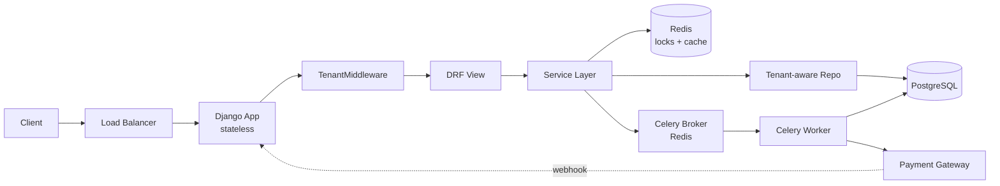

# PROJECT_SPEC — `cart_system`

> Single source of truth for the multi-tenant cart system.
>
> **Status:** Active — Iteration 1 (scaffold + spec).
> **Owner:** Platform / Commerce.
> **Audience:** Engineers extending or operating this system.

---

## How to read this spec

This document is the contract. Every iteration that follows must:

1. Reference the section it implements (e.g., "implements §4 Architectural Principles → Idempotency").
2. Treat any deviation from this spec as a spec-change first, code-change second. Update the spec, get review, then ship code.
3. Prefer correctness, reversibility, and clarity over cleverness. If a shortcut is taken, it is documented inline as an `# ADR-NOTE:` comment in code.

The spec is intentionally opinionated. It locks design decisions early so reviewers can focus on implementation quality, not endless re-litigation of architecture.

---

## 1. Project Overview

`cart_system` is a multi-tenant shopping cart and checkout service designed for a single-deployment, single-database SaaS commerce platform that hosts thousands of stores ("tenants") behind one Django application. It is the Zid-style operating model: one codebase, one Postgres cluster, one Redis cluster, many tenants, zero cross-tenant data leakage.

**Operating posture:**

- **Always-online.** Cart and checkout outages translate directly to lost revenue across every tenant. The system is built to fail partially, not totally: a degraded payment provider must not take down cart reads; a slow tenant must not starve others.
- **Multi-tenant by construction.** Tenancy is not a feature bolted on top — it is encoded in the data model, the ORM layer, the request pipeline, the cache keys, the lock keys, and the log fields.
- **Single PostgreSQL cluster** (primary + future read replicas) is the system of record. Redis is the coordination layer (locks, rate limits, broker for Celery).

**Service Level Objectives (initial targets; revisit after first month of production data):**

| Surface              | Availability | Latency p50 | Latency p99 |
| -------------------- | ------------ | ----------- | ----------- |
| Cart reads (`GET`)   | 99.95%       | < 50 ms     | < 300 ms    |
| Cart writes (`POST`) | 99.95%       | < 100 ms    | < 500 ms    |
| Checkout            | 99.9%        | < 250 ms    | < 800 ms    |
| Payment finalization (async) | 99.9% within 5 min | n/a | n/a |

**Error budget posture:** writes that touch payment may degrade to "queued/pending" rather than fail outright; reads must not depend on the payment subsystem at all.

---

## 2. Core Requirements

The minimum feature set for this system, expressed as named service operations. Each operation is implemented in the service layer (§4) and exposed via a REST endpoint (§5).

| # | Operation             | Endpoint (v1)                              | Caller(s)         | Atomicity                     | Idempotent? |
| - | --------------------- | ------------------------------------------ | ----------------- | ----------------------------- | ----------- |
| 1 | Add product           | `POST   /v1/carts/{cart_id}/items`         | Customer, B2B     | Single tx                      | Natural via PK |
| 2 | Remove product        | `DELETE /v1/carts/{cart_id}/items/{id}`    | Customer, B2B     | Single tx                      | Yes         |
| 3 | Apply coupon          | `POST   /v1/carts/{cart_id}/coupons`       | Customer, B2B     | Single tx + Redis lock         | Yes (per cart+code) |
| 4 | Remove coupon         | `DELETE /v1/carts/{cart_id}/coupons/{id}`  | Customer, B2B     | Single tx                      | Yes         |
| 5 | Add payment method    | `POST   /v1/customers/{id}/payment-methods`| Customer, B2B     | Single tx                      | Yes (key per method) |
| 6 | Add address           | `POST   /v1/customers/{id}/addresses`      | Customer, B2B     | Single tx                      | Yes         |
| 7 | Checkout              | `POST   /v1/carts/{cart_id}/checkout`      | Customer, B2B     | Tx + Redis lock + idem-key     | **Required** (header `Idempotency-Key`) |

### Bonus features (in-scope; later iterations)

These are part of the deliverable, not stretch goals — they ship in subsequent iterations under this same spec.

- **Invoice handling.** Every successful order produces an invoice. Invoice generation is async (Celery), idempotent (one invoice per order), and persisted with a monotonic per-tenant invoice number (`tenant_id`, `sequence`) — guarded by a Postgres advisory lock or a sequence table to prevent gaps under contention.
- **Coupon constraints.** A coupon may carry one or more constraints, all evaluated atomically at apply-time and re-evaluated at checkout (state can drift between apply and checkout):
  - cart minimum subtotal
  - customer location (country / region allowlist)
  - customer segment (B2B-only, first-purchase-only, VIP, etc.)
  - per-customer usage cap and global usage cap
  - validity window (start/end)
  - product/category allowlist or denylist
- **B2B orders.** A `B2B` cart variant supports: tax-exempt status, purchase-order references, multi-line shipping splits, net-N payment terms, approval workflows (creator vs. approver), and B2B-only coupons. Modeled as a `cart.kind` discriminator plus a `b2b_metadata` one-to-one relation; checkout takes a different terminal state (`pending_approval`, `pending_invoice`) when the buyer is on net terms.

### Error taxonomy (RFC 7807 problem+json)

A small, stable set of error types — used by every endpoint:

- `tenant/not-found`, `tenant/disabled`
- `cart/not-found`, `cart/locked`, `cart/empty`, `cart/stale-version`
- `product/not-found`, `product/out-of-stock`, `product/price-changed`
- `coupon/not-found`, `coupon/expired`, `coupon/limit-reached`, `coupon/constraint-failed`
- `payment/method-invalid`, `payment/declined`, `payment/gateway-unavailable`
- `idempotency/conflict`, `idempotency/in-progress`
- `validation/*`, `auth/*`, `rate-limit/exceeded`

---

## 3. Constraints

### 3.1 Single shared PostgreSQL

All tenants share one logical database. **No schema-per-tenant, no database-per-tenant.** Rationale:

- Operational simplicity at thousands of tenants — one migration run, one connection pool, one backup strategy.
- Cheap onboarding of new tenants (an `INSERT` into `tenants`, not a schema bootstrap).
- Honest about the failure mode: a noisy tenant is a noisy tenant, addressed via per-tenant rate limits and (eventually) per-tenant connection quotas, not by hiding it behind a separate schema.

Trade-off accepted: blast radius of a single Postgres outage is global. Mitigated by HA Postgres, future read replicas, and (much later) sharding by `tenant_id` (§9).

### 3.2 Strict tenant isolation

Two layers, defense-in-depth:

1. **Application layer.** Every domain model has a non-null `tenant_id` column. Every `Manager` is tenant-aware: it refuses to return a queryset unless a tenant is set on the current request context (a `contextvars.ContextVar` populated by `TenantMiddleware`). A bare `Model.objects.all()` raises in non-debug.
2. **Database layer.** Composite indexes lead with `tenant_id`. Foreign keys are validated to be same-tenant via `CHECK` constraints on the related row's `tenant_id`. PostgreSQL Row-Level Security (RLS) is on the roadmap for §9 once we have a stable tenant context propagation pattern.

Cross-tenant access from internal admin tooling is an explicit, audited operation — not the default.

### 3.3 Pluggable payment system

A `PaymentGateway` interface is the only thing the domain knows about. Concrete gateways (`MockGateway`, `StripeGateway`, `HyperPayGateway`, `TabbyGateway`, …) live behind a registry keyed by gateway slug per tenant. Domain code never imports a gateway module directly.

Interface (illustrative):

```python
class PaymentGateway(Protocol):
    slug: str
    def authorize(self, charge: ChargeRequest) -> AuthorizationResult: ...
    def capture(self, authorization_id: str, amount: Money) -> CaptureResult: ...
    def refund(self, capture_id: str, amount: Money) -> RefundResult: ...
    def webhook_verify(self, headers: Mapping[str, str], body: bytes) -> WebhookEvent: ...
```

Adding a new gateway is: implement the protocol, register it, write a contract test against the shared `PaymentGatewayContractTests`. No core changes.

### 3.4 Race-condition handling

Three levels, used appropriately:

- **Database row locks.** `SELECT ... FOR UPDATE` on `cart` rows during checkout, on `coupon_redemption` during coupon usage decrement, on `payment_intent` during state transitions.
- **Optimistic concurrency.** A `version` integer column on `cart` and `cart_item` for read-heavy paths where a row lock would be excessive. Update statements include `WHERE version = :v` and bump `version`; zero-row-affected = `409 cart/stale-version`.
- **Distributed locks (Redis).** For operations that span more than the database — e.g., calling out to a payment gateway during checkout — a Redis `SET NX PX` lock with a fenced token (UUIDv7), TTL > worst-case checkout latency, no auto-renewal. Lock keys: `lock:checkout:{tenant_id}:{cart_id}` and `lock:coupon:{tenant_id}:{coupon_code}`.

### 3.5 Other hard constraints

- All money is `Decimal` (never `float`) and carried with an explicit ISO 4217 currency code.
- All timestamps are `TIMESTAMPTZ`, stored UTC, serialized RFC 3339.
- All IDs are UUIDs (§6); no sequential public IDs.

---

## 4. Architectural Principles

### 4.1 Service layer (no business logic in views)

```
HTTP ──► URLRouter ──► DRF View ──► Serializer (input validation only)
                                 │
                                 ▼
                    Service function (business logic, transactions, locks)
                                 │
                                 ▼
                  Repository / ORM Manager (tenant-scoped queries)
                                 │
                                 ▼
                              PostgreSQL
```

- Views are thin: parse, validate, dispatch, serialize the result.
- Services are functions (not god-classes). One service module per app: `apps/<domain>/services.py`. Inputs and outputs are typed dataclasses / Pydantic-style DTOs.
- Repositories wrap querysets when a query is reused across services or is non-trivial; otherwise services use the ORM directly via the tenant-aware manager.

### 4.2 Multi-tenancy via `tenant_id`

- Every domain model: `tenant_id = models.UUIDField(db_index=True, editable=False)`.
- `TenantMiddleware` runs before authentication-derived logic, resolves the tenant from a stable signal (subdomain → `Host` header → `X-Tenant-ID` header → JWT claim, in that order), and writes it into a `ContextVar`.
- `TenantAwareManager.get_queryset()` reads the `ContextVar` and applies `.filter(tenant_id=...)`. Missing context raises `TenantContextMissing` rather than returning all rows.
- Tests run with an explicit `tenant_context(tenant)` context manager that sets/unsets the var; forgetting it makes tests fail loudly.

### 4.3 Transactions for critical operations

- `transaction.atomic()` wraps the service body for: checkout, coupon apply/redeem, payment-method add, address add, order creation, invoice creation.
- Savepoints (`atomic(savepoint=True)`) for compensable sub-steps inside checkout (e.g., reserve inventory → authorize payment → finalize).
- `transaction.on_commit(...)` is the *only* place async tasks are scheduled. Tasks are never enqueued mid-transaction.
- `select_for_update()` is used for any row whose state we're about to mutate based on its current value.

### 4.4 Distributed locking (Redis)

- Library: `redis-py` directly, with a thin `redis_lock(key, ttl_ms, token)` helper. We do **not** rely on `redis.lock` because we want explicit fenced tokens for safe release.
- Pattern: `SET key token NX PX ttl_ms`; release is `EVAL` of the standard "compare token then DEL" Lua script.
- Locks are held only for the critical section. Long-running work (gateway calls) is wrapped, but TTL is sized to the gateway timeout + safety margin, not the whole request.
- Locks are **advisory**, not authoritative. The database row lock + version column is the actual safety net; Redis locks are a coordination optimization to keep contention out of the database.

### 4.5 Idempotency for checkout

- `POST /v1/carts/{cart_id}/checkout` requires header `Idempotency-Key: <client-generated-uuid>`.
- An `idempotency_record(tenant_id, key, request_hash, response_status, response_body, created_at)` table with a unique index on `(tenant_id, key)`.
- First call: row inserted in `in_progress` state inside the same transaction; on commit, response body and status are written back.
- Replay with same key + same request hash: return the stored response.
- Replay with same key + different request hash: `409 idempotency/conflict`.
- Replay while `in_progress`: `409 idempotency/in-progress` (client should poll or back off).
- TTL: 24h, swept by a Celery beat job.

### 4.6 Async processing for payments

- Celery on Redis broker. Workers run the `payments`, `invoices`, and `notifications` queues separately so a slow gateway doesn't block invoice generation.
- Sync HTTP path for checkout returns `202 Accepted` with a `payment_status: "pending"` for gateways that require redirect/3DS, or `200 OK` with `payment_status: "authorized"` for inline gateways.
- Final state arrives via webhook (`POST /v1/payments/webhooks/{gateway_slug}`) or via a Celery-driven poller for gateways without webhooks. Both paths converge on the same `PaymentIntent` finite state machine.
- Tasks are idempotent: keyed by `(payment_intent_id, attempt)`, with Postgres-stored deduplication.

### 4.7 Request flow



### 4.8 Stack justification (locked)

| Concern         | Choice                          | Why                                                                     |
| --------------- | ------------------------------- | ----------------------------------------------------------------------- |
| Language        | Python 3.11+                    | Required by the assignment.                                             |
| Web framework   | Django 5.1                      | Required by the assignment; mature ORM, admin, auth, migrations.        |
| API layer       | Django REST Framework 3.15      | De-facto standard for Django REST APIs; clean serializer/view contracts.|
| Primary store   | PostgreSQL 16                   | Required by the spec ("single PostgreSQL"); strong consistency, RLS.    |
| Cache + locks   | Redis 7                         | Spec mandates Redis for distributed locking; also Celery broker.        |
| Async workers   | Celery 5                        | Mature, Django-native, explicit retries/queues. Allowed by the assignment ("you can use whatever Message Broker & Workers you want"). Reuses Redis as broker — no extra infra. Reversible: services depend on a `tasks.py` interface, not on Celery imports. |
| API docs        | drf-spectacular                 | Generates OpenAPI 3.1 from DRF; one source of truth.                    |
| Tests           | pytest + pytest-django + factory_boy | Faster, clearer than Django's default test runner.                  |
| Logging         | structlog or python-json-logger | Structured JSON logs with bound tenant/request context.                 |
| Lint / format   | ruff + black                    | Fast, opinionated, low maintenance.                                     |

---

## 5. Non-Functional Requirements

### 5.1 High availability

- **Stateless app tier.** No on-disk state. Sessions, locks, idempotency records, rate-limit counters all externalized.
- **Graceful degradation.** Cart reads succeed even if Celery, the payment gateway, or the email service is down. Checkout falls back to "queued" rather than failing if the gateway is degraded (configurable per gateway).
- **Health probes.** `/healthz` (liveness, no deps) and `/readyz` (readiness, checks Postgres + Redis).
- **Timeouts everywhere.** No unbounded waits on external calls. Default budgets: DB query 2s, Redis op 100ms, gateway call 8s, webhook handler 3s.
- **Circuit breakers** around payment gateways (per-gateway, per-tenant), trip on consecutive failures.

### 5.2 Scalability

- **Horizontal app tier.** Add pods; no sticky sessions.
- **Read replicas (planned, §9).** A `DATABASE_ROUTERS` entry routes annotated read-only views to replicas once available.
- **Connection management.** PgBouncer in transaction-pool mode in front of Postgres; per-tenant soft cap on concurrent connections.
- **Hot path caching.** Per-tenant catalog reads are cacheable behind Redis with short TTLs and explicit invalidation on writes.

### 5.3 Consistency in checkout

Checkout is the linearization point. Within a single cart:

- One Redis lock per `(tenant_id, cart_id)` ensures only one checkout proceeds at a time.
- The lock-protected section runs `SELECT ... FOR UPDATE` on the cart row, re-validates every line item's price and stock, re-evaluates every coupon constraint, then transitions to `Order` + `PaymentIntent` in a single Postgres transaction.
- The `PaymentIntent` is a strict FSM: `requires_confirmation → authorized → captured → succeeded` (and parallel failure paths `failed`, `cancelled`, `refunded`). Illegal transitions are rejected at the database layer via a `CHECK` constraint backing a small allow-list table.
- Reads are eventually consistent across replicas (when added); writes always go to the primary.

### 5.4 Clean API design

- **Resource-oriented URLs.** `/v1/carts/{id}/items/{id}`. No verbs in paths except for true actions (`/checkout`).
- **Versioned.** `/v1/`. Breaking changes go to `/v2/`; `v1` is supported for at least 12 months past `v2` GA.
- **Errors.** RFC 7807 problem+json, with stable `type` URIs (the error taxonomy in §2).
- **Pagination.** Cursor-based for list endpoints. No offset pagination on tenant-shared tables.
- **Conditional requests.** `ETag` + `If-Match` on cart writes to give clients optimistic-concurrency control.
- **Filtering.** Predictable, documented query params; no ad-hoc `?q=` magic.
- **OpenAPI 3.1.** Generated by drf-spectacular, served at `/api/schema/` and `/api/docs/`.
- **Auth.** Bearer tokens (JWT). Tenant resolution is an *orthogonal* concern from authentication; both must succeed.

---

## 6. Engineering Standards

### 6.1 Naming

- Python: `snake_case` for modules/functions/variables, `PascalCase` for classes, `SCREAMING_SNAKE_CASE` for constants.
- URLs: `kebab-case`, plural resources (`/payment-methods`, not `/paymentMethod`).
- DB: `snake_case`, plural table names, `tenant_id` always first in compound indexes.
- Service functions: verb-led, intent-revealing — `add_item_to_cart`, `apply_coupon_to_cart`, `checkout_cart`. No `process()`, `handle()`, `manager()`.

### 6.2 Identifiers

- Every model has `id = models.UUIDField(primary_key=True, default=uuid7, editable=False)`.
- UUIDv7 (time-ordered) chosen over UUIDv4 for B-tree friendliness on primary keys at scale. A small `cart_system/common/ids.py` provides `uuid7()` until the stdlib supports it natively.
- No sequential public IDs ever leak from the API. Internal Postgres `BIGSERIAL` may exist for invoice numbering, but never as a public identifier.

### 6.3 Structured logging

- JSON logs to stdout. Mandatory fields on every log record:
  - `timestamp` (RFC 3339 UTC), `level`, `event`, `logger`
  - `tenant_id`, `request_id`, `actor_id` (when authenticated)
  - `cart_id`, `order_id`, `payment_intent_id` (when in scope)
  - `latency_ms` for request/operation logs
  - `error.type`, `error.message`, `error.stack` for errors
- `RequestIdMiddleware` reads `X-Request-ID` or generates a UUIDv7, propagates via `ContextVar` and response header.
- No PII in logs (no full card numbers, no full addresses, no emails — log a tenant-scoped hash instead).

### 6.4 Validation and error handling

- Input validation in serializers (DRF). Domain rules in services (raised as typed exceptions).
- A custom DRF exception handler maps `DomainError` subclasses to RFC 7807 problem+json with the §2 taxonomy. Unhandled exceptions become `500 server/internal-error` with a `request_id` the client can quote in support tickets.
- Never trust the client. Re-validate price, stock, coupon eligibility, and tenant ownership at write time, even if they were checked on read.

### 6.5 Testing

- **Frameworks:** pytest + pytest-django + factory_boy.
- **Layers:**
  - Unit tests on services (fast, no DB where possible via in-memory fakes for repos).
  - Integration tests on services with a real Postgres (transactional test cases).
  - API tests on views (DRF `APIClient`) covering happy paths, auth, tenant isolation, error taxonomy.
  - Contract tests on every `PaymentGateway` implementation, sharing a `PaymentGatewayContractTests` base.
  - Concurrency tests for checkout and coupon apply (forked workers hitting the same cart/coupon).
- **Coverage targets:**
  - Overall ≥ 85%.
  - `services/checkout.py`, `services/coupons.py`, `services/payments.py` ≥ 95%.
  - 100% of `PaymentGateway` implementations against the shared contract.
- **Tenant-isolation test.** A dedicated test suite that, for every list/detail endpoint, asserts that tenant A cannot read or mutate tenant B's data via any combination of header tampering, ID guessing, or auth confusion.

### 6.6 Migrations

- One migration per logical change. No squashing without explicit need.
- Backwards-compatible for at least one release: add column nullable → backfill → make non-null in a later release. Never break old app pods mid-rollout.
- Long-running migrations (backfills, index builds) run out-of-band, not in the deploy pipeline.

---

## 7. Design Philosophy

Decisions in this codebase are made through a staff/VP lens.

1. **Correctness first.** A correct slow path beats a fast wrong one. We will gladly accept p99 budget headroom in exchange for a checkout that never double-charges.
2. **Boring tech.** Postgres, Redis, Django, Celery. None of these will surprise the on-call engineer at 3am. Exotic choices need a written justification in the PR.
3. **Reversible decisions are made fast; irreversible ones are made slow.** Schema and API contracts are irreversible — they get the most scrutiny. Internal helper structure is reversible — it gets the least.
4. **Optimize for the next engineer, not the original author.** Clear names, obvious flow, linear control structure. If a reader has to hold three files in their head to understand one function, the design is wrong.
5. **No premature distribution.** The system is one Django process and one database until measured load demands otherwise. Scaling §9 is a roadmap, not a starting point.
6. **Document decisions where the code lives.** Non-obvious choices are inline `# ADR-NOTE:` comments referencing the spec section. The spec is the index; the code carries the rationale.
7. **Fail loudly in development, gracefully in production.** Asserts and strict checks in tests; circuit breakers and fallbacks in prod.
8. **Multi-tenancy is not negotiable.** Any code path that could leak tenant data is a release blocker, full stop.

---

## 8. Out of Scope (for now)

The following are intentionally not built in the first delivery. Each has a clear future home but is excluded today to keep the scope honest.

- **Real payment gateway integrations.** A `MockGateway` and a `SandboxGateway` (deterministic, configurable success/failure) are sufficient for end-to-end tests. The pluggable interface (§3.3) means real gateways drop in later.
- **Microservices split.** The system is a single Django service. Domain boundaries are kept clean enough that extraction is possible later, but not pursued now.
- **Kubernetes / production infra.** A `docker-compose.yml` running app + Postgres + Redis + worker is the deployment story for now. Production infra (k8s manifests, Helm charts, Terraform) is a later concern.
- **Multi-region.** Single-region active-passive is assumed. Multi-region active-active is a much larger redesign.
- **Identity provider / SSO.** A simple JWT with a tenant claim is the auth story for the assignment. SAML/OIDC/SSO integration is later.
- **GDPR data-deletion workflows.** Soft-delete is supported in models from day one (`deleted_at` on PII-bearing tables); orchestrated tenant-wide erasure is later.
- **Real-time inventory.** Stock checks are at-cart-add and at-checkout against the catalog table. A reservation system with TTL holds is a later iteration.
- **Tax engine.** Flat per-tenant tax rates initially; integration with a tax provider (Avalara, etc.) is later.

---

## 9. Future Scaling Notes

A roadmap, not a commitment. Each entry is a known next step the architecture is *prepared for*, not one it currently *implements*.

### 9.1 Read replicas

- Add Postgres read replicas; route read-heavy endpoints (cart read, catalog browse, order history) via a `DATABASE_ROUTERS` entry plus a `using('replica')` annotation on the service-layer call sites that opt in.
- Replica lag is exposed as a metric; views that cannot tolerate lag (post-write reads of own data) explicitly opt out.

### 9.2 Sharding

- Sharding key: `tenant_id`. The choice was made on day one (every table carries `tenant_id`, every query filters by it) precisely so this is feasible later.
- Likely path: Citus (Postgres extension) for transparent sharding; fallback path is application-level sharding with a tenant→shard router.
- Triggered when the primary Postgres shows sustained CPU > 70% or storage > 70% headroom.

### 9.3 Event-driven architecture

- **Outbox pattern** is the bridge: domain events are written to an `outbox` table inside the same transaction as the state change, then relayed to a real broker (Kafka or Redpanda) by a dedicated relayer.
- Consumers: search index updater, analytics warehouse loader, partner webhook fan-out, fraud scoring.
- This is preferred over double-writes (DB + broker) because it preserves transactional consistency.

### 9.4 CQRS for analytics

- Analytics and reporting queries read from a denormalized projection (materialized views or a separate OLAP store) rather than the OLTP tables. Write path stays normalized.

### 9.5 Edge caching

- Catalog reads (per-tenant, per-locale) are eligible for CDN caching with short TTLs and tag-based purging on writes.

### 9.6 Per-tenant rate limits

- Redis token bucket per tenant per endpoint class. Limits are configurable per tenant tier (free / pro / enterprise). Enforced in middleware before the view runs, before any DB query is issued.

### 9.7 PostgreSQL Row-Level Security

- Once tenant context propagation is rock-solid, enable RLS as a belt-and-suspenders defense against application-layer bugs. Application sets `SET LOCAL app.tenant_id = ...` per transaction; RLS policies filter every row based on it.

---

## Appendix A — Repository layout (target, end-state)

This is where iteration N>1 is heading; iteration 1 only contains the project skeleton at the root.

```text
.
├── PROJECT_SPEC.md
├── README.md
├── manage.py
├── requirements.txt
├── pyproject.toml
├── docker-compose.yml
├── cart_system/
│   ├── __init__.py
│   ├── settings/
│   │   ├── __init__.py
│   │   ├── base.py
│   │   ├── dev.py
│   │   └── prod.py
│   ├── asgi.py
│   ├── wsgi.py
│   ├── urls.py
│   └── celery.py
├── apps/
│   ├── common/           # tenant ctx, ids, problem+json, logging, idempotency
│   ├── tenants/
│   ├── catalog/
│   ├── carts/
│   ├── coupons/
│   ├── addresses/
│   ├── payments/         # gateway interface, registry, payment_intent FSM
│   ├── orders/
│   └── invoices/
└── tests/
    ├── unit/
    ├── integration/
    └── concurrency/
```

## Appendix B — Glossary

- **Tenant.** A store. The owning unit of all customer-facing data in the system.
- **Cart.** A mutable, per-customer collection of items, coupons, an address, and a payment method, scoped to a tenant.
- **Checkout.** The atomic transition from cart to order + payment intent.
- **Order.** Immutable record of a successful checkout.
- **PaymentIntent.** The state machine tracking a single payment attempt for an order.
- **Idempotency-Key.** Client-supplied UUID making a write retry-safe.
- **Fenced token.** A unique value bound to a lock acquisition, used to prove ownership at release time.

---

*End of spec. Subsequent iterations reference sections by number.*
