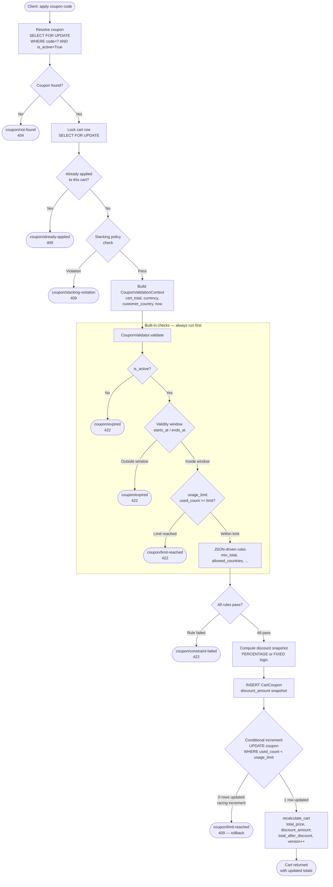
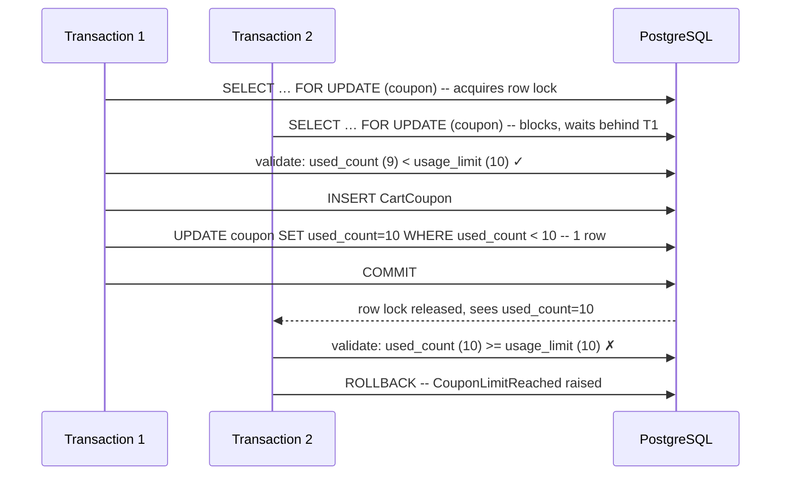
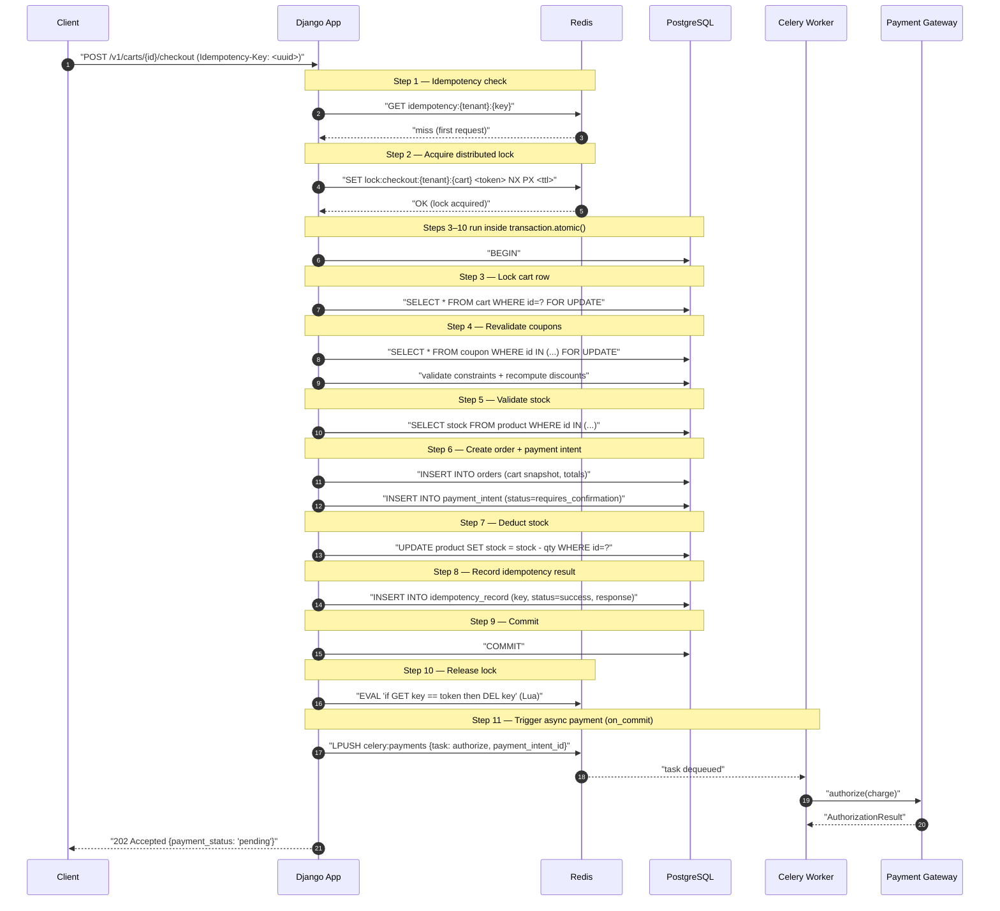

# Architecture — `cart_system`

> Snapshot of the system as implemented. For the full design contract, SLOs, and
> future roadmap see [PROJECT_SPEC.md](../PROJECT_SPEC.md).

---

## 1. Overview

`cart_system` is a multi-tenant shopping cart and checkout service running on a
**single Django 5.1 process**, a **single PostgreSQL 16 cluster**, and a
**single Redis 7 cluster**. One deployment hosts thousands of stores ("tenants")
with zero cross-tenant data leakage. The architecture follows the Zid-style
operating model: shared infrastructure, tenant-encoded data, no per-tenant
schema or database provisioning.

**What is implemented today:**

| App | Has models + services | Notes |
|---|---|---|
| `apps/tenant` | Yes | `Tenant`, `TenantAwareModel`, `TenantAwareManager`, `TenantMiddleware` |
| `apps/catalog` | Yes | `Product` — price, stock, currency; `ck_product_stock_nonneg` DB CHECK added |
| `apps/cart` | Yes | `Cart`, `CartItem`, full add/remove/recalculate service; checkout URL wired |
| `apps/coupon` | Yes | `Coupon`, `CartCoupon`, full apply/remove/revalidate service + rule registry |
| `apps/addresses` | Yes | `Address` — soft-delete, one default per user |
| `apps/order` | Yes | `Order`, `OrderItem`, `CheckoutService` (full production flow), typed exceptions, DRF view + serializer, integration + API tests |
| `apps/payment` | Yes | `Payment`, `PaymentMethod`; `PaymentGateway` ABC + registry + 3 dummy gateways; `PaymentService` (authorize/capture/void/refund); `authorize_payment` Celery task; full contract + service + registry tests — see [docs/payment-gateways.md](payment-gateways.md) |
| `apps/core` | Yes | `IdempotencyRecord` model + migration, `redis_lock` (fenced Lua), `IdempotencyManager`, `CoreDomainError` subclasses |
| `apps/invoice` | Yes | `InvoiceSequence`, `Invoice`; two-phase generation — atomic sequence + row creation inside `transaction.atomic`, PDF render outside; idempotent via `OneToOneField` + status-guarded `pdf_url` UPDATE; dispatched from `PaymentService` via `transaction.on_commit` |

Redis is active for:
- Distributed checkout lock: `lock:checkout:{tenant_id}:{cart_id}` — `SET NX PX` + fenced Lua `compare-token-then-DEL` release.
- Idempotency in-progress sentinel: `idem:{tenant_id}:{key}` — set before the lock, cleared in `finally` on success or failure.
- Celery broker (db/1) + result backend (db/2) — three named queues: `payments`, `invoices`, `notifications`.

Celery is configured with `CELERY_TASK_ALWAYS_EAGER=True` in test settings so the `authorize_payment` task runs synchronously in tests without a real broker.

---

## 2. Architecture Diagrams

Visual walkthroughs of every major subsystem. Each diagram is self-contained with a short guarantee summary beneath it.

| Diagram | What it shows |
|---------|---------------|
| [System Architecture](diagrams/system-architecture.md) | Full component map: clients, Django API, PostgreSQL, Redis, Celery, gateway registry, health, observability |
| [Checkout Sequence](diagrams/checkout-sequence.md) | Step-by-step checkout: tenant resolution, idempotency, Redis lock, `transaction.atomic`, stock update, `on_commit`, Celery payment task |
| [Tenant Isolation Flow](diagrams/tenant-isolation-flow.md) | `X-Tenant-Domain` → `TenantMiddleware` → `ContextVar` → `TenantAwareManager` → tenant-scoped queries; foreign-tenant resources return 404 |
| [Payment Flow](diagrams/payment-flow.md) | Gateway dispatch, dummy gateway paths, `Payment` FSM (`REQUIRES_CONFIRMATION → AUTHORIZED / FAILED`), retry handling |
| [Invoice Generation Flow](diagrams/invoice-flow.md) | `on_commit` trigger, two-phase generation (DB row + PDF), idempotent retry via `OneToOneField` + status-guarded UPDATE |
| [Cache, Idempotency & Locks](diagrams/cache-idempotency-locks.md) | Cart read cache invalidation, Redis idempotency sentinel, PostgreSQL durable record, Lua-fenced checkout lock |
| [B2B Buyer Flow](diagrams/b2b-flow.md) | `set-business-details`, cart metadata, checkout snapshot onto `Order`, invoice reads from `Order` (not `Cart`) |
| [Data Model ERD](diagrams/data-model-erd.md) | All 13 persistent models, their key fields, and every FK / association across the 8 apps |

---

## 3. Multi-tenancy Strategy

### 3.1 The `tenant_id` approach

Every domain model inherits [`TenantAwareModel`](../apps/tenant/models.py), an
abstract base that adds:

- `tenant` — non-null `ForeignKey` to `Tenant`, `on_delete=PROTECT`.
- `created_at` / `updated_at` — audit timestamps.
- `objects = TenantAwareManager()` — the enforcement manager.

`Tenant` itself is a plain Django model (name + domain + is\_active). Onboarding
a new tenant is an `INSERT` into the `tenants_tenant` table — no schema
bootstrap, no migration.

### 3.2 Isolation guarantees — three layers

```
┌──────────────────────────────────────────────────────────────┐
│  Layer 1: Request                                            │
│  TenantMiddleware — resolves tenant from X-Tenant-Domain,    │
│  writes ContextVar, aborts with 400/403/404 on failure       │
├──────────────────────────────────────────────────────────────┤
│  Layer 2: ORM                                                │
│  TenantAwareManager — every get_queryset() auto-filters by   │
│  tenant; create/get_or_create auto-stamp; bare Model.objects │
│  raises TenantContextMissing when context is unset           │
├──────────────────────────────────────────────────────────────┤
│  Layer 3: Schema                                             │
│  Composite indexes lead with tenant_id; UniqueConstraint on  │
│  (tenant, id) on every table as scaffolding for future       │
│  composite-FK same-tenant enforcement at the DB layer        │
└──────────────────────────────────────────────────────────────┘
```

**Key Guarantees:**
- No double checkout — tenant context is resolved and locked to a single `Tenant` row before any service code runs; a mismatched or missing header aborts the request before touching any data.
- No coupon overuse — `TenantAwareManager` auto-scopes every queryset, so a coupon belonging to tenant B is invisible to tenant A's apply call regardless of what the client sends.
- Strong tenant isolation — three independent enforcement layers (middleware, ORM manager, schema indexes) must all fail simultaneously for cross-tenant data to leak; each layer is independently testable and independently auditable.

### 3.3 Enforcement layers — detail

**Request layer — [`TenantMiddleware`](../apps/tenant/middleware.py)**

Runs before auth. Reads the `X-Tenant-Domain` header, queries `Tenant.objects.get(domain=...)`, and writes the resolved tenant into a `ContextVar` via `set_current_tenant`. The reset token is stored and applied in a `try/finally` so the context is always restored — even on an unhandled exception — before the next request lands on the same worker.

Inactive tenants return `403`; missing header returns `400`; unknown domain returns `404`.

**ORM layer — [`TenantAwareManager`](../apps/tenant/managers.py)**

`get_queryset()` is the single enforcement point:

```python
def get_queryset(self) -> TenantAwareQuerySet:
    if not is_tenant_set():
        raise TenantContextMissing()
    return TenantAwareQuerySet(self.model, using=self._db).filter(
        tenant=get_current_tenant()
    )
```

Every derived queryset (`filter`, `get`, `exclude`, …) operates on an already-scoped base — no double-filtering, no way to forget the filter. `all_tenants()` is the explicit, deliberately ugly-named escape hatch for admin tooling and migrations; its use requires a code comment justifying it.

**Schema layer**

- All composite indexes lead with `tenant`: `ix_cart_tenant_user`, `ix_cartitem_tenant_cart`, `ix_coupon_tenant_active_ends`, etc.
- `UniqueConstraint(fields=["tenant", "id"])` on `Cart`, `Coupon`, `CartCoupon`, `Address` — scaffolding for future composite `FK (tenant_id, <model>_id)` same-tenant guards (§9.7 RLS roadmap in the spec).
- DB `CHECK` constraints enforce domain invariants independently of the ORM (non-negative prices, valid ISO 4217 codes, validity window ordering).

**Tests**

A `tenant_context(tenant)` context manager (`apps/tenant/context.py`) sets/unsets the `ContextVar`. Forgetting it makes tests raise loudly — isolation tests verify that tenant A cannot read or mutate tenant B's data via header tampering or ID guessing.

---

## 4. Cart System

### 4.1 Data model

**`Cart`** ([`apps/cart/models.py`](../apps/cart/models.py))

| Field | Purpose |
|---|---|
| `id` | UUID primary key |
| `tenant` | Tenant FK (inherited) |
| `user_id` | UUID — loose ref to customer, no FK to `auth.User` |
| `status` | `ACTIVE` \| `CHECKED_OUT` |
| `total_price` | Denormalised sum of `quantity × price_snapshot` over all items |
| `discount_amount` | Denormalised sum of `CartCoupon.discount_amount` snapshots |
| `total_after_discount` | `max(total_price - discount_amount, 0)` — clamped at zero |
| `currency` | ISO 4217 three-letter code; must match every item's currency |
| `version` | Optimistic concurrency token; incremented on every mutation |

`user_id` is a bare `UUIDField`, not an FK to `auth.User`. The cart aggregate is intentionally decoupled from Django's auth system — identity provider integration is deferred (spec §8).

**`CartItem`**

| Field | Purpose |
|---|---|
| `cart` | FK to `Cart`, `CASCADE` |
| `product_id` | UUID — loose ref to `catalog.Product`, no FK |
| `quantity` | Positive integer; `CHECK quantity >= 1` |
| `price_snapshot` | Price at add-time (Decimal); survives catalog price changes |
| `currency` | Must match `Cart.currency` |

`UniqueConstraint(fields=["cart", "product_id"])` enforces one line per product per cart at the DB layer. Adding the same product twice increments `quantity`, it does not create a duplicate row.

`product_id` is a bare `UUIDField` — no FK to `catalog.Product`. Price and stock validation happen in the service at add-time and again at checkout. This keeps the cart aggregate decoupled from the catalog app.

### 4.2 Price snapshot reasoning

`CartItem.price_snapshot` captures the catalog price at the moment the item is added. The live catalog price may drift before the customer checks out. At checkout, the service re-reads the live price and surfaces `product/price-changed` if the delta is outside tolerance.

The same reasoning applies to `CartCoupon.discount_amount` — it is a snapshot of the computed discount at apply-time, not a live recalculation. Checkout revalidates and may recompute it.

Snapshots exist for three reasons:
1. **Cart reads are cheap** — no aggregation join against the catalog on every read.
2. **Removal is deterministic** — removing a coupon subtracts a known, fixed amount.
3. **UX fidelity** — the customer sees the price they agreed to, not a live fluctuating number.

### 4.3 `recalculate_cart`

Every mutating service (`add_product_to_cart`, `remove_product_from_cart`, `apply_coupon_to_cart`, `remove_coupon_from_cart`) calls `recalculate_cart` as its final step. It:

1. Aggregates `SUM(quantity * price_snapshot)` over items.
2. Aggregates `SUM(discount_amount)` over applied coupons.
3. Computes `payable = max(items_total - coupons_total, 0)`.
4. Persists all three fields and bumps `version` via `F("version") + 1` — the increment is computed in SQL atomically with the write.

`recalculate_cart` is intentionally not wrapped in its own `transaction.atomic` — callers already hold the transaction boundary and pass the locked cart row in.

---

## 5. Coupon System

### 5.1 Data model

**`Coupon`** ([`apps/coupon/models.py`](../apps/coupon/models.py))

| Field | Purpose |
|---|---|
| `code` | Natural key within a tenant; `UniqueConstraint(tenant, code)` |
| `discount_type` | `PERCENTAGE` \| `FIXED` |
| `value` | Percentage points (1–100) or absolute monetary amount |
| `currency` | Null for PERCENTAGE (currency-agnostic); required for FIXED |
| `constraints` | Opaque `JSONField` — evaluated by the rule registry |
| `usage_limit` | Nullable integer cap; null = unlimited |
| `used_count` | Atomic counter; `CHECK used_count <= usage_limit` when cap is set |
| `is_active` | Soft-deactivation flag; inactive coupons are never hard-deleted |
| `starts_at` / `ends_at` | Optional validity window; `CHECK ends_at >= starts_at` |

**`CartCoupon`** — the join between `Cart` and `Coupon`, storing the discount snapshot at apply-time. `UniqueConstraint(cart, coupon)` prevents re-applying the same coupon to the same cart.

### 5.2 Rule-based validation (registry pattern)

Coupon constraints are stored as an opaque JSON dict on the `Coupon` model (e.g. `{"min_total": "50.00", "allowed_countries": ["SA", "AE"]}`). The `CouponValidator` class ([`apps/coupon/validators.py`](../apps/coupon/validators.py)) dispatches each key to a registered handler:

```python
class CouponValidator:
    _rules: ClassVar[dict[str, RuleFn]] = {}   # process-wide, populated at import time

    @classmethod
    def register(cls, key: str) -> Callable[[RuleFn], RuleFn]:
        def deco(fn: RuleFn) -> RuleFn:
            cls._rules[key] = fn
            return fn
        return deco
```

Adding a new constraint is one decorator — no edits to `validate()`:

```python
@CouponValidator.register("per_customer_usage_cap")
def _check_per_customer_cap(coupon, value, ctx):
    ...
```

**Dispatch order in `validate()`:**

1. **Built-in always-on checks** (run regardless of the `constraints` dict):
   - `is_active` — deactivated coupons surface as "not found" to avoid leaking state.
   - Validity window — `starts_at` / `ends_at` against `ctx.now`.
   - `usage_limit` — column-first; falls back to the JSON key for coupons imported from external tooling.
2. **JSON-driven rules** — iterated in insertion order of `coupon.constraints`. First failure raises; unknown keys fail closed:

```python
handler = self._rules.get(key)
if handler is None:
    raise CouponConstraintFailed(key, f"no validator registered for constraint '{key}'")
handler(coupon, value, ctx)
```

Failing closed on unknown keys means a typo in admin tooling (`"min_totla": 50`) is rejected rather than silently skipped.

**Built-in registered rules today:**

| Key | Rule |
|---|---|
| `min_total` | Cart subtotal must meet or exceed the value (cart currency) |
| `allowed_countries` | Customer's country must be in the ISO 3166-1 alpha-2 allowlist |
| `usage_limit` | Fallback for coupons that store the cap in JSON rather than the column |

`CouponValidationContext` (a frozen dataclass) carries `cart_total`, `cart_currency`, `customer_country`, and `now` — built once per apply call and passed to every rule. Rules are read-only; they validate and never mutate.

### 5.3 Stacking policy

`CouponService` ([`apps/coupon/services.py`](../apps/coupon/services.py)) enforces a class-level `STACKING_POLICY` before the validator runs:

| Policy | Behaviour |
|---|---|
| `UNLIMITED` | No stacking guard. Only the `(cart, coupon)` unique constraint applies. Any number of distinct coupons may be applied. |
| `ONE_PER_DISCOUNT_TYPE` | **Default.** At most one `PERCENTAGE` coupon and at most one `FIXED` coupon per cart. A PERCENTAGE + a FIXED can coexist; a second PERCENTAGE is rejected with `CouponStackingViolation`. Matches the most common retail behaviour ("extra 10% off" stacks with a "$5 voucher"). |
| `SINGLE_ONLY` | Any second coupon is rejected. Suitable for tenants whose promotion rules allow at most one active discount per order. |

The policy is a class attribute (`CouponService.STACKING_POLICY`), making it configurable per deployment without changing service code. Tests override it per-instance via the `__init__` injected parameter.

Lock order inside `_enforce_stacking_policy`: the cart row is already locked by the time this runs, so the existing-applications query is consistent with the subsequent insert.

### 5.4 Discount calculation logic

`_compute_discount` in [`apps/coupon/services.py`](../apps/coupon/services.py):

**PERCENTAGE:**
```
discount = cart.total_price × value / 100
           quantised to 0.01, ROUND_HALF_UP
```

`ROUND_HALF_UP` is the conventional retail rounding mode — banker's rounding would surprise customers.

**FIXED:**
```
already_discounted = SUM(applied CartCoupon.discount_amount)
remaining          = cart.total_price - already_discounted
discount           = min(coupon.value, max(remaining, 0))
                     quantised to 0.01, ROUND_HALF_UP
```

FIXED discounts are applied against the post-PERCENTAGE-discount subtotal, clamped at zero. This ordering is pinned in code and in tests — deterministic stacking math is what makes the cart total predictable regardless of the order coupons are applied.

The DB `CHECK ck_cart_total_after_discount_nonneg` is the schema-level safety net that the cart total can never go negative.

### 5.5 Coupon validation flow

The diagram below traces a single `apply_coupon_to_cart` call from the initial request through every guard layer, including all failure exits.



**Key Guarantees:**
- No double checkout — the cart row lock (step 2) serialises concurrent apply and checkout calls on the same cart; the `UniqueConstraint(cart, coupon)` is a DB-level backstop against a re-apply race.
- No coupon overuse — the conditional `UPDATE … WHERE used_count < usage_limit` (step after INSERT) closes every race window: validator pass + row lock + conditional increment together form a three-layer guard; the DB `CHECK ck_coupon_used_within_limit` is the schema-level last resort.
- Strong tenant isolation — `TenantAwareManager` scopes the initial `SELECT FOR UPDATE` to the active tenant's coupons; a code that belongs to another tenant raises `coupon/not-found` rather than leaking that the coupon exists.

**Failure path rollback.** Every failure exit between `BEGIN` and `COMMIT` raises a typed `CouponDomainError` subclass. The `@transaction.atomic` boundary rolls back atomically — any `CartCoupon` row inserted in the same transaction is undone, and `used_count` is never incremented for a failed apply.

---

## 6. Concurrency & Consistency

### 6.1 `select_for_update` usage

Every mutating service re-fetches the row it is about to change with `select_for_update()` inside `transaction.atomic`:

```python
@transaction.atomic
def add_product_to_cart(cart, product, quantity):
    locked = Cart.objects.select_for_update().get(pk=cart.pk)
    ...
```

For `apply_coupon_to_cart`, **two** rows are locked in a fixed order to avoid the classic A→B / B→A deadlock:

1. **Coupon row first** — `Coupon.objects.select_for_update().get(code=coupon_code, is_active=True)`.
2. **Cart row second** — `Cart.objects.select_for_update().get(pk=cart.pk)`.

This lock order is consistent across `apply` and `revalidate_cart_coupons` — both always acquire coupon-then-cart.

### 6.2 Conditional update for `usage_limit`

The `used_count` increment is not a plain F-expression; it is a **conditional UPDATE**:

```python
rows = Coupon.objects.filter(
    pk=coupon.pk,
    used_count__lt=F("usage_limit"),
).update(used_count=F("used_count") + 1)
if rows == 0:
    raise CouponLimitReached(...)
```

`zero rows affected` means either the cap was already reached or another concurrent transaction incremented past it between the validator check and this UPDATE. Either way: the apply is refused and the transaction rolls back — the `CartCoupon` row created earlier in the same transaction is atomically undone.

The decrement on coupon removal is symmetric:

```python
Coupon.objects.filter(pk=coupon_id, used_count__gt=0).update(
    used_count=F("used_count") - 1
)
```

`WHERE used_count > 0` prevents underflow even if a buggy path forgot to increment.

### 6.3 Race condition handling strategy

Defence in depth — three guards close every known window:



**Key Guarantees:**
- No double checkout — the `SELECT FOR UPDATE` on the cart row serialises concurrent checkout and coupon-apply attempts on the same cart; only one transaction proceeds at a time.
- No coupon overuse — the conditional `UPDATE … WHERE used_count < usage_limit` closes the race window that the validator alone cannot: even if two transactions both pass the pre-write check, exactly one will increment and the other will raise `CouponLimitReached` and roll back.
- Strong tenant isolation — every queryset in this path goes through `TenantAwareManager`, so `T1` and `T2` can only contend on rows that belong to the same tenant; cross-tenant rows are not visible.

| Guard | Catches |
|---|---|
| **Validator check** | Cheap early rejection before any write |
| **`SELECT FOR UPDATE`** | Serialises concurrent applies on the same coupon; T2 sees T1's committed `used_count` |
| **Conditional UPDATE** | Residual window on backends that downgrade row locks (SQLite in tests); also protects any future code path that reads without a lock |
| **DB `CHECK ck_coupon_used_within_limit`** | Schema-level last-resort; rejects any `used_count > usage_limit` regardless of how it got there |

`select_for_update` is advisory at the spec level (§3.4): "the database row lock + version column is the actual safety net; Redis locks are a coordination optimisation." Redis distributed locks for coupon apply are deferred to the checkout iteration — they are not needed here because `apply_coupon` makes no external calls.

---

## 7. Design Principles

### 7.1 Service layer architecture

```
HTTP → DRF View (parse, validate input, dispatch)
         │
         ▼
     Service function (business logic, row locks, transactions)
         │
         ▼
  TenantAwareManager / ORM (scoped queries, auto-stamps)
         │
         ▼
      PostgreSQL
```

- **Views are thin.** They parse input, call one service function, and serialise the result. No business rules in views.
- **Services are functions or small service objects.** One `services.py` per app. `CouponService` is a class because it carries injectable state (`_validator`, `_stacking_policy`); cart services are module-level functions because they have no injected dependencies.
- **Services call each other only at the boundary.** `CouponService` imports `recalculate_cart` from `apps.cart.services` inside the method body (deferred import) to avoid circular imports at module load.

### 7.2 Transaction usage

`@transaction.atomic` decorates every mutating service entry point. The pattern is:

1. Open transaction.
2. Re-fetch rows with `select_for_update`.
3. Validate (raise on failure — transaction rolls back automatically).
4. Write.
5. Call `recalculate_cart` as the final step.

`recalculate_cart` is intentionally **not** wrapped in its own `transaction.atomic`. It is always called from within a caller's existing transaction — wrapping it would silently create a savepoint rather than sharing the outer transaction, which would be semantically wrong.

`transaction.on_commit(...)` is the only place Celery tasks are scheduled. Tasks are never enqueued mid-transaction — a rolled-back transaction would otherwise enqueue a task for a state that never committed.

### 7.3 Validation approach

Three layers, outermost to innermost:

1. **DRF serializers** — input shape, type coercion, presence of required fields. No domain rules here.
2. **Service-layer Python guards** — fail fast before opening a transaction or issuing a DB write (e.g. `if quantity < 1: raise ValueError`). Cheap, no I/O.
3. **Domain exceptions** — typed subclasses of `CouponDomainError` ([`apps/coupon/exceptions.py`](../apps/coupon/exceptions.py)), each carrying a stable `type` URI aligned with the RFC 7807 error taxonomy in spec §2 (`coupon/not-found`, `coupon/expired`, `coupon/limit-reached`, `coupon/constraint-failed`). A future DRF exception handler maps these to `problem+json` responses.
4. **DB constraints** — `CheckConstraint`, `UniqueConstraint`, partial unique indexes — the schema-level safety net that holds regardless of ORM bypass (raw SQL, migrations, shell).

The rule is: never trust the client. Price, stock, coupon eligibility, and tenant ownership are re-validated at write time even if they were checked on read.

---

## 8. Trade-offs So Far

### Why single DB

One Postgres cluster shared by all tenants is an explicit choice (spec §3.1):

- **Operational simplicity.** One migration run, one connection pool, one backup strategy, one monitoring target. At thousands of tenants, per-tenant schemas or databases multiply operational surface without adding isolation that the `tenant_id` column already provides.
- **Cheap onboarding.** A new tenant is one `INSERT`, not a schema bootstrap script.
- **Sharding is kept open.** Every table carries `tenant_id`, every query filters by it, and every index leads with it. When the primary shows sustained load, Citus (Postgres extension) can shard transparently by `tenant_id` without application-layer changes. The architecture is sharding-ready, not sharding-required.

Accepted blast radius: a single Postgres outage is global. Mitigated by HA Postgres (primary + replicas), read-replica routing for non-critical paths, and PgBouncer in transaction-pool mode.

### Why rule-based coupon system

The constraint set on a coupon grows unpredictably — regional promotions, B2B-only codes, first-purchase caps, product allowlists. Encoding each rule as a model column or as an `if/elif` chain in `validate()` would require a migration and a service-code change for each new rule.

The registry pattern makes the validator **open for extension, closed for modification**:

- Adding a new rule: one `@CouponValidator.register("key")` decorated function. `validate()` is untouched.
- Removing a rule: delete the function; any coupon carrying that key in its `constraints` dict will now fail closed (`CouponConstraintFailed("key", "no validator registered")`), surfacing the stale configuration rather than silently widening eligibility.
- Unknown keys always fail closed — a typo in admin tooling cannot accidentally skip a restriction.

The rules dispatch on `coupon.constraints` (a JSON dict), so rule parameters are stored per-coupon without a schema migration. The trade-off is that constraints are opaque to SQL queries — you cannot efficiently filter "all coupons where min_total > 100" without JSON path operators. For the current requirements (apply-time validation, not coupon search), this is acceptable.

### Why not overengineering

Several complexity-adding patterns were deliberately deferred:

| Pattern | Deferred because |
|---|---|
| Redis distributed locks for coupon apply | `apply_coupon` makes no external calls. `SELECT FOR UPDATE` + conditional UPDATE closes every race window. Redis locks arrive with checkout, where the gateway call creates a genuine external-call window. |
| `uuid7()` time-ordered UUIDs | The `uuid4` interim costs nothing at current scale; the spec §6.2 migration to `uuid7()` is a one-line swap once `cart_system/common/ids.py` lands. |
| Structured address fields (line1 / line2 / postal\_code / state) | Internationalisation requirements are not yet stable. The opaque `details` TextField is sufficient for order fulfilment and country-constraint evaluation. |
| Real payment gateway integrations | A `MockGateway` suffices until the service interface (`PaymentGateway` Protocol) is stable and the checkout FSM is implemented. |
| `apps/order`, `apps/payment`, `apps/invoices` | These apps are scaffolded (models/migrations exist) but their service logic ships in subsequent iterations. The scaffold establishes the naming and directory conventions without locking in premature implementation decisions. |

The governing principle (spec §7.5): "No premature distribution. The system is one Django process and one database until measured load demands otherwise."

---

## 9. Checkout Flow

Checkout is the linearization point — the only path that combines a Redis distributed lock, a Postgres transaction with row locks, async payment dispatch, and idempotency enforcement in a single flow.



**Key Guarantees:**
- No double checkout — the Redis `SET NX` lock allows only one checkout per `(tenant, cart)` to enter the critical section at a time; the idempotency record deduplicates retries that arrive after the lock is released.
- No coupon overuse — coupon rows are re-locked with `SELECT FOR UPDATE` and revalidated inside the checkout transaction (step 4), so any coupon that became invalid or over-limit between apply-time and checkout-time is caught before the order is committed.
- Strong tenant isolation — the distributed lock key is namespaced by `tenant_id` (`lock:checkout:{tenant}:{cart}`), and every Postgres query inside the transaction runs through `TenantAwareManager`; a checkout for tenant A cannot observe or mutate tenant B's cart, coupons, stock, or orders.

### How the pieces interlock

**Idempotency check first.** The `idempotency_record` lookup against Redis (or Postgres, depending on the iteration) runs before any lock or DB write. A repeat request with the same `Idempotency-Key` returns the stored response immediately — no lock acquired, no transaction opened, no charge attempted. A request that is still `in_progress` returns `409 idempotency/in-progress`.

**Redis lock wraps the DB transaction, not the other way around.** The distributed lock (`SET NX PX`) is acquired before `BEGIN` and released after `COMMIT`. This is deliberate: the lock also guards the window between `COMMIT` and the gateway call (enqueueing the Celery task). If the lock only covered the Postgres transaction, two concurrent checkouts could both commit valid orders and both enqueue payment tasks before either lock expired. The TTL is sized to the gateway timeout plus a safety margin.

**`transaction.on_commit` for the Celery task.** The payment task is enqueued via `transaction.on_commit(...)`, which fires only after a successful `COMMIT`. If the transaction rolls back — due to a stock failure, a coupon constraint violation, or any other domain error — the task is never enqueued. There is no payment task for an order that was never created.

**Failure path.** Any exception raised between `BEGIN` and `COMMIT` rolls back the transaction atomically (order, stock deduction, idempotency record all undone). The Redis lock is released in a `try/finally` block that wraps the entire critical section — including the `COMMIT` — so the lock is always freed regardless of how the checkout terminates.

**Response shape.** Gateways that require a redirect or 3DS challenge return `202 Accepted` with `payment_status: "pending"`. Inline gateways that resolve synchronously return `200 OK` with `payment_status: "authorized"`. Both paths converge on the same `PaymentIntent` finite state machine; the final captured/failed state arrives via webhook or a Celery poller.

---

## 10. Pluggable Payment Gateways

The full design, extension guide, and example skeleton are in
**[docs/payment-gateways.md](payment-gateways.md)**.

### Summary

`apps/payment/gateways/` implements:

| Component | File | Purpose |
|---|---|---|
| `PaymentGateway` ABC | `base.py` | Contract every gateway must satisfy |
| Result dataclasses | `base.py` | `AuthorizationResult`, `CaptureResult`, `VoidResult`, `RefundResult` |
| Registry | `registry.py` | `register_payment_gateway` / `get_payment_gateway` / `unregister_payment_gateway` |
| Dummy gateways | `dummy.py` | `DummySuccessGateway`, `DummyFailingGateway`, `DummyTimeoutGateway` |

`PaymentService` (`apps/payment/services.py`) is the only caller of gateway
methods.  It enforces FSM transitions with status-guarded UPDATEs:

```python
rows = Payment.objects.filter(
    pk=payment.pk,
    status=Payment.Status.REQUIRES_CONFIRMATION,
).update(status=Payment.Status.AUTHORIZED, gateway_authorization_id=ref)
```

The `zero-rows-updated` path is the idempotency guard — a Celery re-delivery
after a successful commit is a safe no-op.

### Data flow

```
CheckoutService
    └─ creates Payment(status=REQUIRES_CONFIRMATION, provider=<slug>)
    └─ transaction.on_commit → enqueue authorize_payment task

authorize_payment (Celery, queue=payments)
    └─ PaymentService.authorize_payment(payment_id)
           └─ get_payment_gateway(payment.provider)  ← registry lookup
           └─ gateway.authorize_payment(order, payment_method)
           └─ FSM-guarded UPDATE → AUTHORIZED or FAILED
```

No `if/else` on gateway slug anywhere in the service or task layer.

---

---

## 11. Invoice System

### 11.1 Design goals

Three constraints shaped the invoice implementation:

1. **DB transactions must be short.** Allocating a sequence number and writing a row takes microseconds. Rendering a PDF (file I/O) takes milliseconds. Mixing them holds a row lock 100× longer than necessary.
2. **Generation must be idempotent.** A Celery re-delivery, a network timeout, or a worker crash must not duplicate invoice rows or corrupt the per-tenant sequence.
3. **PDF failures must be recoverable.** If the PDF renderer fails or the worker crashes between phases, the system needs a clear signal ("this invoice needs a PDF") without losing the allocated number.

### 11.2 Data model

**`InvoiceSequence`** — one row per tenant, protected by `select_for_update`.

| Field | Purpose |
|---|---|
| `tenant` | OneToOneField to `Tenant` |
| `last_number` | Monotonically increasing counter; never decremented |

**`Invoice`**

| Field | Purpose |
|---|---|
| `id` | UUID primary key |
| `order` | `OneToOneField` to `Order` — enforces structural uniqueness at the DB layer |
| `number` | Per-tenant monotonic integer; `UniqueConstraint(tenant, number)` |
| `total` / `taxes` / `currency` | Snapshot values at invoice creation time |
| `pdf_url` | Empty string until Phase 2 completes; non-empty = PDF confirmed written |
| `generated_at` | `auto_now_add` timestamp of the DB row commit |

### 11.3 Two-phase generation flow

```
Celery worker: generate_invoice(order_id)
│
├── PHASE 1 — transaction.atomic()
│   ├── SELECT order FOR UPDATE  (guard: status must be PAID)
│   ├── SELECT InvoiceSequence FOR UPDATE  (exclusive per-tenant counter lock)
│   ├── last_number += 1  →  save
│   └── INSERT Invoice(number=N, pdf_url="")  ← committed; row visible immediately
│       [IntegrityError on duplicate order → fetch existing row, proceed to Phase 2]
│
├── PHASE 2 — outside any transaction
│   ├── render_invoice_pdf(...)  →  writes MEDIA_ROOT/invoices/<uuid>.pdf
│   └── UPDATE Invoice SET pdf_url=<url> WHERE pk=<id> AND pdf_url=""
│       [0 rows → another worker already set it; safe no-op]
│
└── return {"invoice_id": ..., "invoice_number": N, "pdf_url": ...}
```

**Idempotency table:**

| Scenario | Phase 1 result | Phase 2 result |
|---|---|---|
| First call | INSERT succeeds, number N allocated | PDF rendered, `pdf_url` set |
| Retry after Phase 1 crash | `IntegrityError` caught → fetch existing row (number N already allocated) | PDF rendered, `pdf_url` set |
| Retry after Phase 2 crash | `IntegrityError` caught → fetch existing row, `pdf_url = ""` → re-render | PDF re-rendered, status-guarded UPDATE writes URL |
| Retry after both phases succeed | `IntegrityError` caught → fetch existing row, `pdf_url` already set → return immediately | No render |

### 11.4 Dispatch chain

```
PaymentService.authorize_payment(payment_id)
    └─ FSM-guarded UPDATE → Payment.status = AUTHORIZED
    └─ FSM-guarded UPDATE → Order.status = PAID
    └─ transaction.on_commit → enqueue_generate_invoice(order_id)
                                   │
                                   ▼
                           invoices queue (Celery)
                               generate_invoice task
                                   │
                                   ▼
                           InvoiceService.generate_invoice_for_order(order_id)
```

The `transaction.on_commit` hook ensures no invoice task is ever enqueued for an order that was never committed — a critical guarantee given the two-phase design.

### 11.5 Failure handling

| Failure point | Outcome | Recovery |
|---|---|---|
| Phase 1 DB failure | Transaction rolls back; no row, no sequence increment | Celery retries task; Phase 1 runs cleanly |
| Phase 2 PDF render failure | Row with `pdf_url=""` persists; exception propagates | Celery retries via `max_retries=5` + exponential backoff; Phase 1 skipped (idempotency fast-path); Phase 2 re-renders |
| Worker crash mid-Phase 2 | Same as render failure — `pdf_url` still `""` | Celery `acks_late=True` redelivers message; retry succeeds |
| Concurrent duplicate delivery | Second worker hits `IntegrityError` in Phase 1 → fetches existing row | If `pdf_url` already set: returns immediately. If `pdf_url=""`: one worker wins the status-guarded UPDATE, other detects 0 rows and skips |

---

## 12. Reliability & Consistency Summary

The following mechanisms combine to form the system's reliability posture. Each is independently testable and auditable.

| Mechanism | Where applied | What it prevents |
|---|---|---|
| Redis distributed lock (`SET NX PX` + Lua fenced unlock) | Checkout critical section | Concurrent checkouts on the same cart from multiple API workers |
| `Idempotency-Key` + `IdempotencyRecord` | Checkout endpoint | Client retries re-processing an already-committed checkout |
| `select_for_update` | Cart, coupon, payment, order, invoice sequence | Lost-update race conditions on high-contention rows |
| Conditional stock UPDATE (`WHERE stock >= qty`) | Checkout — stock deduction step | Negative stock from concurrent checkouts |
| `transaction.on_commit` | All Celery task dispatches | Tasks enqueued for rolled-back transactions |
| Status-guarded FSM UPDATEs | Payment, Order, Invoice | Duplicate Celery deliveries re-applying state transitions |
| `OneToOneField` constraint | Invoice → Order | Duplicate invoice rows regardless of ORM-level idempotency |
| `acks_late=True` + `max_retries` + `retry_backoff` | All async tasks | Lost tasks on worker crash; thundering retry herd |
| DB `CHECK` constraints | Cart totals, coupon counts, stock | Schema-level last resort independent of ORM code paths |

---

## 13. Scaling Considerations

### Today

One Django process, one Postgres cluster, one Redis cluster. This is not a limitation — it is a deliberate choice (spec §7.5). Complexity is added when measured load demands it, not before.

### Horizontal API scaling

Adding Django workers is zero-configuration: all shared state lives in Postgres and Redis. The Redis lock namespace (`lock:checkout:{tenant_id}:{cart_id}`) distributes cleanly — no affinity required.

### Read scaling

All non-mutating queries (`cart reads`, `product browse`, `coupon lookup`) can route to a Postgres **read replica** via Django's `DATABASE_ROUTERS` without any ORM or service changes. The `TenantAwareManager` is routing-agnostic.

### Write scaling and sharding

Every table has `tenant_id` as the leftmost key in every composite index. Citus (Postgres sharding extension) can distribute by `tenant_id` column transparently. The only code change required is converting `all_tenants()` cross-tenant queries (already explicitly named and commented) to cross-shard scatter-gather.

### Celery worker scaling

The three-queue split (`payments`, `invoices`, `notifications`) allows independent worker pools:
- **Payment workers** are I/O-bound on gateway latency → scale by adding workers.
- **Invoice workers** are CPU-bound on PDF rendering → scale by adding workers or using a dedicated PDF microservice.
- **Notification workers** are network-bound → cheapest to scale.

### Event-driven evolution

The `transaction.on_commit → Celery` dispatch pattern is already event-driven in spirit. Migrating to Kafka or SQS is a `tasks.py` replacement — no service or model changes required.

---

## 14. Trade-offs

### Shared-schema multi-tenancy

All tenants share one PostgreSQL schema. The `tenant_id` column is the isolation boundary enforced at three layers (middleware, ORM manager, schema indexes). This is operationally simple and sharding-ready, at the cost of a larger blast radius for primary DB outages.

Mitigation: HA Postgres (primary + async replicas), PgBouncer in transaction-pool mode, read replica routing for non-critical paths.

### Dummy payment gateways

Production gateway integrations (Stripe, Moyasar, Tap) are intentionally absent. The `PaymentGateway` ABC is the stable interface; dummy gateways prove the contract and make tests deterministic. Adding a real gateway is three steps: implement the ABC, register the slug, add contract tests. No service or task code changes.

The trade-off: provider-specific behaviors (3DS flows, webhook verification, partial capture quirks) are unproven until a real gateway ships.

### Two-phase invoice vs. single-phase

A single `transaction.atomic` that writes the row and renders the PDF would be simpler. It was rejected because:
- PDF rendering holds a DB row lock for milliseconds, not microseconds, at the per-tenant sequence level.
- A PDF render failure inside a transaction rolls back the already-allocated sequence number, creating gaps that violate the spec's gap-free guarantee.

The two-phase design is more complex but correct: it allocates the number atomically, commits it, and renders outside the lock.

### Intentionally avoided overengineering

| Deferred pattern | Reason |
|---|---|
| Per-tenant Postgres schemas or databases | Operational cost without isolation benefit at current scale |
| Event sourcing / CQRS | No requirement for full audit log or read-model projections |
| gRPC or GraphQL | REST + DRF covers all current consumers |
| `uuid7()` time-ordered keys | `uuid4()` works now; `uuid7()` is a one-line swap when benchmark shows index fragmentation |
| Real-time WebSocket delivery | Polling or webhook callbacks cover all current payment/invoice status needs |

The governing principle: every complexity decision traces to a measured need or a spec requirement. "We might need it" is not a sufficient justification.

---

*For SLOs, API design, security constraints, and the future scaling roadmap, see [PROJECT_SPEC.md](../PROJECT_SPEC.md).*
