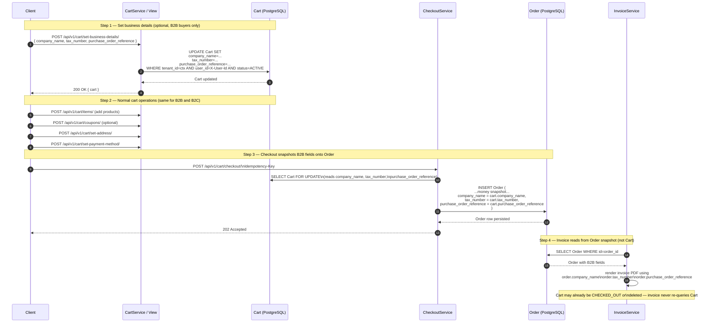

# B2B Buyer Flow

- B2B metadata (`company_name`, `tax_number`, `purchase_order_reference`) is **optional** on the cart; B2C flows simply leave all three fields as empty strings — no branching in the checkout logic.
- `CheckoutService` **snapshots** the three B2B fields verbatim onto the `Order` row at creation time. Once the order exists, the snapshot is immutable — subsequent edits to the cart (or cart deletion) cannot alter the order record.
- `InvoiceService` reads B2B details exclusively from the `Order` snapshot, never from the `Cart`. This keeps the invoice generation path independent of cart lifecycle and ensures invoices remain consistent even if the cart is later modified or cleaned up.
- The same `Order` row serves both B2C (empty B2B fields) and B2B (populated fields) buyers; the invoice rendering layer conditionally includes the business block only when `company_name` is non-empty.
