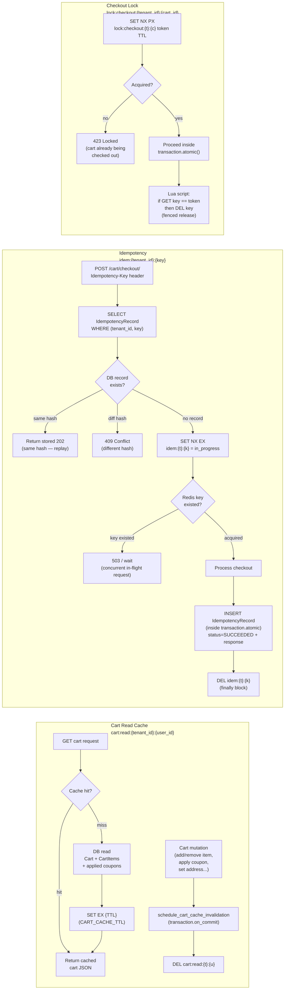

# Cache, Idempotency, and Locks

- The **cart read cache** (`cart:read:{t}:{u}`) is invalidated via `transaction.on_commit`, so a cache entry is never deleted before the mutating transaction is durable — readers never see stale data from an uncommitted write.
- The **idempotency fast path** uses a Redis `SET NX EX` sentinel to detect a concurrent in-flight request for the same key before hitting the database; the durable `IdempotencyRecord` in PostgreSQL handles replay and conflict detection for completed requests across process restarts.
- The `IdempotencyRecord` is inserted **inside** `transaction.atomic()` so a rollback removes the record atomically — there are no "succeeded" records pointing at orders that were never committed.
- The **checkout lock** uses a Lua-fenced release (`GET + DEL if token matches`) to ensure that only the process that acquired the lock can release it, preventing a slow worker from unlocking a lock re-acquired by a newer request.
