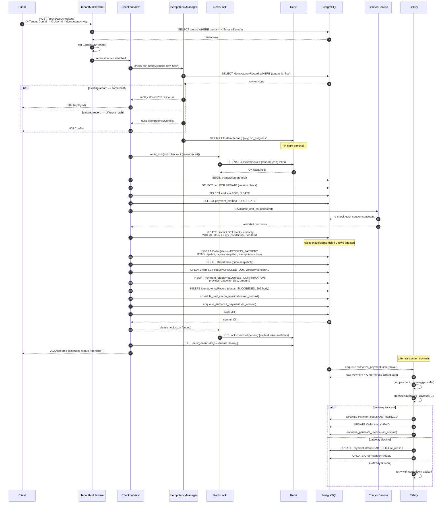

# Checkout Sequence

- The **idempotency check happens before any lock is acquired**: a replayed request returns the stored 202 without touching the database, the stock table, or the gateway.
- The **Redis checkout lock** (`SET NX PX`) prevents two concurrent requests for the same cart from entering `transaction.atomic` simultaneously; the Lua-fenced release ensures only the lock owner can release it.
- **`select_for_update`** on cart, address, and payment_method inside the transaction prevents phantom reads and ensures the checkout sees a consistent, mutation-free view of all three resources until commit.
- **`transaction.on_commit`** guarantees that the Celery task is only enqueued after the database transaction has durably committed — no payment task fires for a cart that was never successfully checked out.
