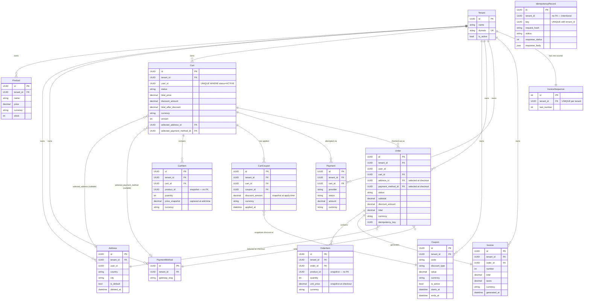

# Data Model — Entity Relationship Diagram

## Notes

- **PostgreSQL is the source of truth.** All uniqueness and validity rules are enforced at the database layer via `UniqueConstraint` and `CheckConstraint`, not only by ORM validation.
- **Tenant isolation** is enforced through `tenant_id` on every domain model and through `TenantAwareManager`, which auto-filters all queries by the active tenant. Cross-tenant data access is structurally prevented.
- **B2B fields** (`company_name`, `tax_number`, `purchase_order_reference`) exist on both `Cart` and `Order` but are omitted from the diagram to reduce noise. They are optional for B2C flows (stored as empty strings) and snapshotted onto `Order` at checkout. See [`b2b-flow.md`](b2b-flow.md) for the full flow.
- **Order and invoice data is snapshotted for auditability.** `OrderItem.product_id` is a bare `UUIDField` (no FK) and `OrderItem.unit_price` is captured at checkout time, so historical order lines remain accurate even if a product is later edited or deleted. `CartItem.price_snapshot` and `CartCoupon.discount_amount` serve the same purpose at cart level. `Order → Address` and `Order → PaymentMethod` are live FK references to the records selected at checkout — not copies of the address or payment data.
