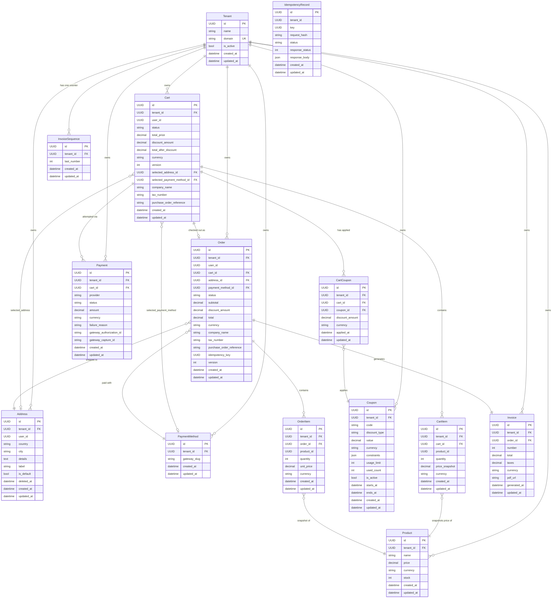

# Data Model — Entity Relationship Diagram

> **Note:** `IdempotencyRecord.tenant_id` is a plain `UUIDField`, not a FK to `Tenant`. This is intentional — it allows the idempotency sweep job to operate without a full tenant context.

- Every domain model (except `IdempotencyRecord`) inherits from `TenantAwareModel`, which supplies `tenant_id FK`, `created_at`, and `updated_at`. The `TenantAwareManager` auto-filters all queries by the active tenant `ContextVar`.
- `CartItem.product_id` and `OrderItem.product_id` are bare `UUIDField`s (no FK to `Product`). Price snapshots decouple the cart and order aggregates from catalog mutations — a product can be deleted without orphaning historical order lines.
- `Payment.provider` is a free-text gateway slug, not a FK, so new gateways can be registered in code without a schema migration.
- `Invoice` has a `OneToOneField(order)` enforced at the DB level — at most one invoice per order, making duplicate invoice generation safe under at-least-once Celery delivery.
