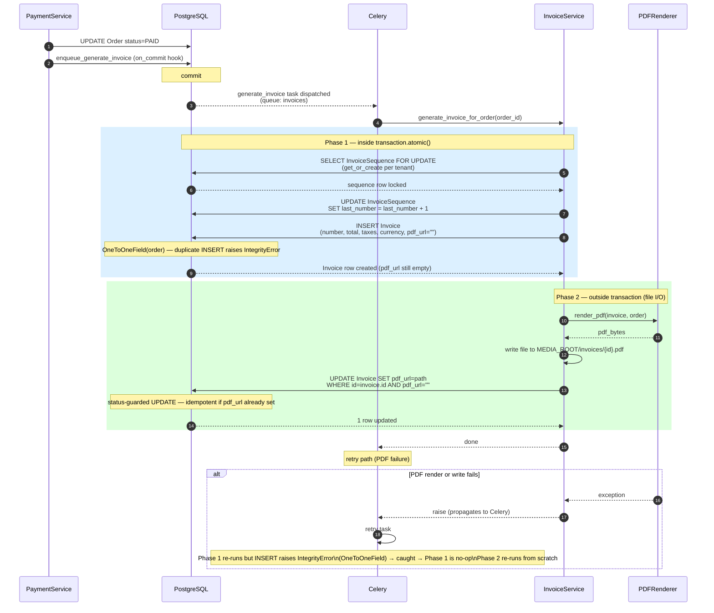

# Invoice Generation Flow

- **Phase 1** (sequence allocation + `Invoice` row insertion) runs inside `transaction.atomic()`. The `OneToOneField(order)` constraint makes a duplicate insert raise `IntegrityError`, which `InvoiceService` catches and treats as a no-op — safe under at-least-once Celery delivery.
- **Phase 2** (PDF rendering + file write) runs **outside** the transaction. Long-running I/O never holds a database lock; the `UPDATE … WHERE pdf_url=""` guard makes the file write idempotent on retry.
- The invoice number is allocated via `SELECT FOR UPDATE` on `InvoiceSequence`, guaranteeing **gap-free monotonic numbering** per tenant without relying on a PostgreSQL sequence or advisory lock.
- `enqueue_generate_invoice` is called via `transaction.on_commit` inside `PaymentService`, so the invoice task is never queued for an order whose payment transition was rolled back.
