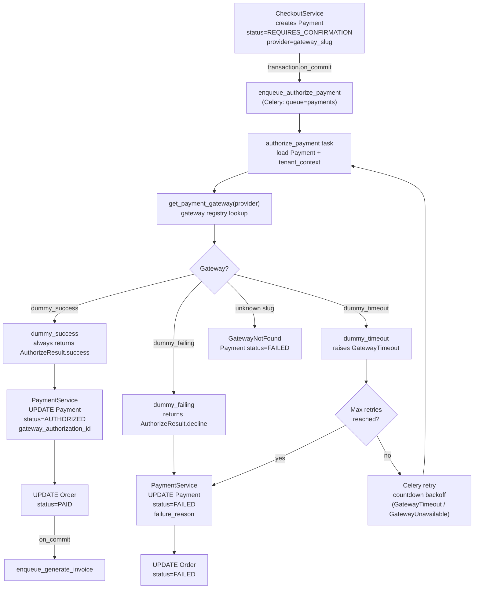
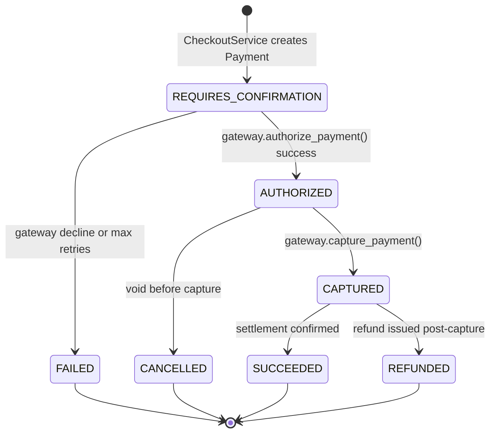

# Payment Flow

## Gateway Dispatch

## Payment Status FSM

- `CheckoutService` creates the `Payment` row **inside** the database transaction; the Celery task is only enqueued after commit via `transaction.on_commit`, so no gateway call fires for a rolled-back checkout.
- `get_payment_gateway(slug)` is the **sole coupling point** between `PaymentService` and any gateway implementation; adding a real gateway requires registering a class — no changes to `PaymentService`.
- The `dummy_timeout` gateway and `GatewayUnavailable` exception trigger **Celery retries with countdown backoff**, making the payment pipeline resilient to transient gateway degradation without blocking the web process.
- Status transitions are enforced at the application layer in `PaymentService`; the `ck_payment_status_valid` DB CHECK is a belt-and-suspenders guard against ORM bypass.
