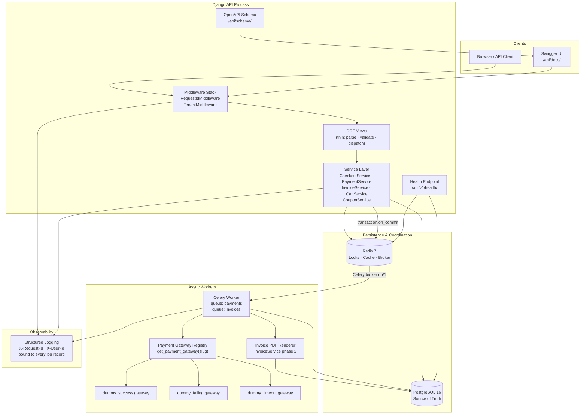

# System Architecture

- Every request passes through `TenantMiddleware` before reaching a view; tenant context is set once and propagated via a `ContextVar` — no per-query tenant parameter threading required.
- PostgreSQL is the **only system of record**. Redis carries ephemeral coordination data (locks, sentinels, cache) that can be lost and rebuilt without data loss.
- Celery workers share the same application code; the gateway registry is populated at startup via `PaymentConfig.ready()` so worker processes have the same gateway map as the web process.
- Health and schema endpoints are exempt from tenant resolution, allowing load-balancer probes and CI schema export to operate without a tenant header.
