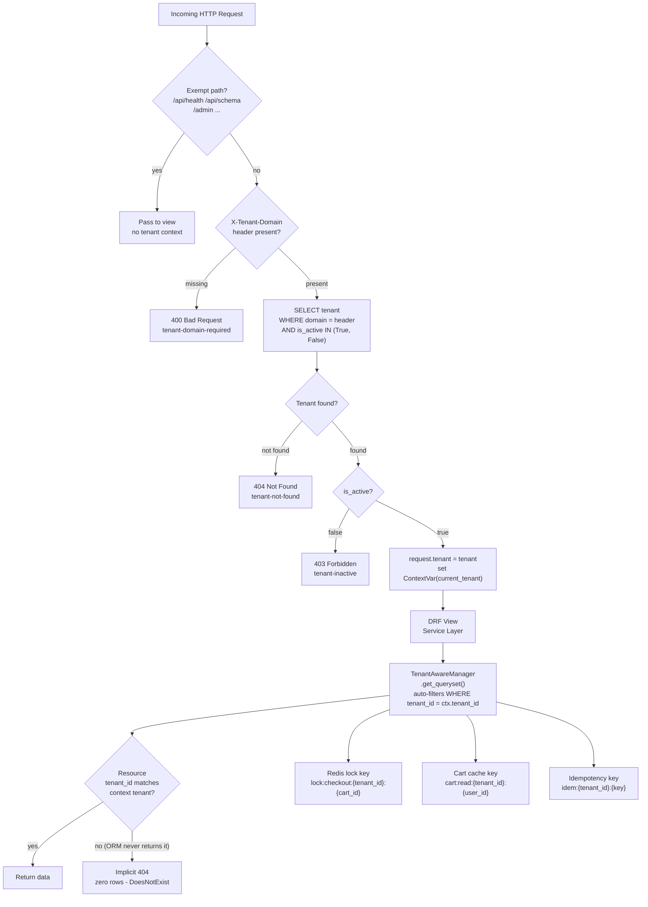

# Tenant Isolation Flow

- `TenantMiddleware` is the **only place** where `X-Tenant-Domain` is resolved to a `Tenant` row; downstream code reads from the `ContextVar` and never re-queries the tenant table.
- `TenantAwareManager` is the **default ORM manager** on every domain model. Its `get_queryset()` unconditionally appends `WHERE tenant_id = <context>`, making a cross-tenant row **invisible**, not just forbidden.
- Every Redis key is **namespaced by `tenant_id`** as the first segment, ensuring that lock contention, cache entries, and idempotency sentinels are fully isolated between tenants even though they share one Redis cluster.
- A request for a resource belonging to a foreign tenant receives a `404`, not a `403` — the resource is treated as if it does not exist, preventing tenant enumeration.
