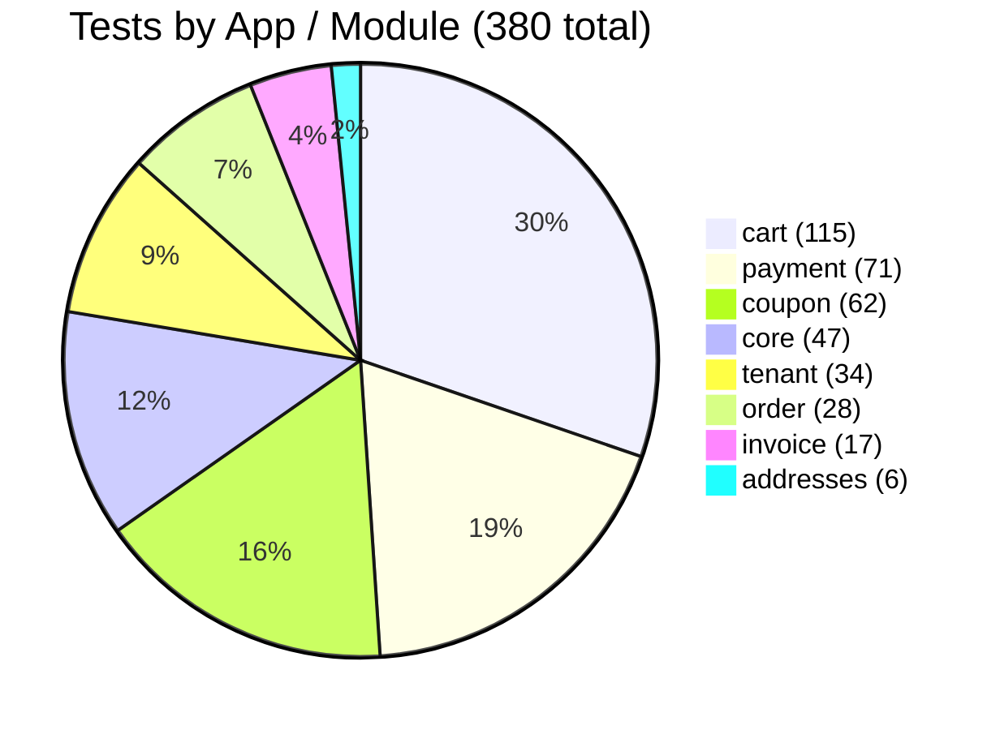
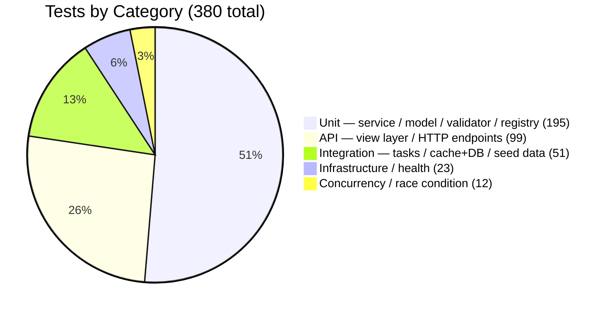
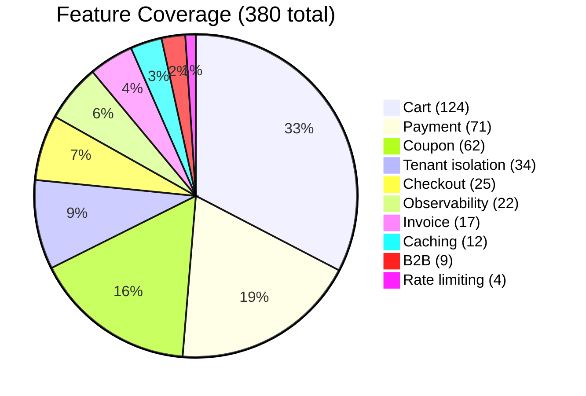

# Test & Quality Summary

`cart_system` ships **380 test functions** (398 pytest nodes) across 27 files and 8 apps. This document summarizes test depth, shows how to run the suite, and explains why concurrency and idempotency coverage is critical for correctness.

---

## Current Test Result

```
DJANGO_SETTINGS_MODULE=cart_system.settings.test pytest -q

398 collected
393 passed, 5 skipped, 0 failed
```

The 5 skipped tests are intentional — see [Skipped Tests](#skipped-tests) below.

> **Collected vs. defined:** 398 pytest nodes > 380 `def test_*` functions because `pytest.mark.parametrize` expands parametrized tests into multiple nodes. The pie charts below use the 380-function count.

> **Configuration:** SQLite in-memory database, `fakeredis` (monkeypatched per test), `CELERY_TASK_ALWAYS_EAGER=True` (tasks run synchronously). Tests that touch `SELECT FOR UPDATE` or `transaction.on_commit` use `@pytest.mark.django_db(transaction=True)`.

---

## How to Run Tests

### Docker (recommended)

```bash
make test                          # full suite inside the container
make test args='-k checkout'       # filter by keyword
make test args='-x -v'             # stop on first failure, verbose
```

### Local (venv)

```bash
# Activate the venv first (optional — the prefix below works without it)
source .venv/bin/activate

# Full suite
pytest -q

# Filter to a domain
pytest apps/cart/ -q
pytest apps/payment/ -q

# Filter by keyword across all apps
pytest -k checkout -q
pytest -k idempotent -q
pytest -k lock -q

# Single test by node ID
pytest apps/order/tests/test_services.py::test_checkout_happy_path -v

# Stop on first failure
pytest -x -v
```

### Settings used for tests

| Setting | Value |
|---------|-------|
| Config file | `pytest.ini` |
| `DJANGO_SETTINGS_MODULE` | `cart_system.settings.test` |
| Database | SQLite (in-memory) |
| Redis | `fakeredis` (monkeypatched) |
| Celery | `CELERY_TASK_ALWAYS_EAGER = True` |
| Password hasher | MD5 (fast) |

---

## Charts

### Tests by App / Module

Counts are exact — each is the number of `def test_*` functions in that app's test files.



---

### Tests by Category

> **Reviewer Summary — manually classified.** Each file is assigned to exactly one category based on what it primarily exercises. The 12 concurrency/race-condition tests are individual functions extracted by name (containing `lock`, `race`, `concurrent`, `stale_version`, or `drift`) from four mixed-purpose files; the remainder of those files fall into their primary category. All counts are reproducible from the [full file breakdown](#full-file-breakdown) below.



---

### Feature Coverage

> **Reviewer Summary — file-level assignment.** Each test file is assigned to the feature it primarily exercises. Files that span multiple features (e.g. `cart/test_views.py` covers cart operations, checkout, coupon actions, and address selection) are assigned to the feature that owns the largest share of their tests. The `core/test_seed_demo_data.py` file (28 tests) is assigned to **cart** because cart creation is the primary seeded artifact under test. Counts are reproducible from the [full file breakdown](#full-file-breakdown) below.



---

## Skipped Tests

**5 tests are skipped. All skips are intentional and expected.**

They originate from the `PaymentGatewayContractTests` mixin in `apps/payment/tests/`. This mixin defines a shared test contract that every gateway implementation must satisfy. Some contract tests only apply to a specific kind of gateway (e.g. "decline returns `FAILED` status" only makes sense for a gateway that can decline), so the mixin calls `pytest.skip()` for conditions that are inapplicable to the concrete gateway under test.

| Skipped test | Reason |
|---|---|
| Decline-path contract on `DummySuccessGateway` | This gateway always succeeds; the decline path is not applicable |
| Timeout-path contract on `DummySuccessGateway` | This gateway never times out |
| Timeout-path contract on `DummyFailingGateway` | This gateway always declines, never times out |
| Success-path contract on `DummyFailingGateway` | This gateway always declines; the success path is not applicable |
| Success-path contract on `DummyTimeoutGateway` | This gateway always times out |

Zero failures and zero unexpected skips is the expected baseline. If a new gateway is added, run the contract mixin against it; new skips must be explicitly justified.

---

## Why Concurrency and Idempotency Tests Matter

### Concurrency

The checkout flow reads the cart, validates stock, deducts stock, and marks the cart as checked-out — a sequence of dependent reads and writes. Without a lock, two simultaneous requests for the same cart can both read the same stock count, both decide there is enough stock, and both deduct from it, leaving the system in an oversold state.

The system uses three layers of protection:

1. **Redis distributed lock** (`apps/core/locks.redis_lock`) — acquired before the database transaction opens. A concurrent request fails to acquire the lock and receives `LockNotAcquired` (mapped to 409) before touching the database.
2. **PostgreSQL `SELECT FOR UPDATE`** (`lock_active_cart_for_update`) — serialises concurrent writes at the row level inside the transaction.
3. **Optimistic version check** (`CartStaleVersion`) — if two requests race past the Redis lock, the one that commits second detects the version mismatch and fails safely.

Tests for `LockNotAcquired`, `CartStaleVersion`, and `ProductOutOfStock` (with rollback verification and dispatcher suppression) prove that none of these failure modes silently corrupt data. **These cannot be verified by code inspection alone** — they require tests that simulate the races that occur under production load.

The same principle applies to coupon usage limits: `test_simulated_race_validator_passed_then_concurrent_commit_at_cap` verifies that a coupon cap is enforced even when a second committer reaches the database after the first validator already passed.

### Idempotency

Network retries, client timeouts, and load-balancer replays mean any checkout endpoint will receive duplicate requests. Without idempotency, a retry creates a second order, charges the customer twice, and generates duplicate invoices.

The system assigns each checkout attempt a client-supplied `Idempotency-Key` UUID. The first request:
1. Acquires an in-progress Redis sentinel (`SET NX`).
2. Executes the checkout inside `transaction.atomic()`.
3. Stores the full serialised response in a durable `IdempotencyRecord`.

Any subsequent request with the same key returns the stored response immediately — no gateway call, no stock deduction, no second order.

Three idempotency paths are exercised in tests:

| Scenario | Expected behaviour | Test |
|---|---|---|
| Same key, same body, after completion | Returns stored 202 — no second order | `test_idempotent_replay_returns_same_order` |
| Same key, different body | Returns 409 `idempotency/conflict` | `test_idempotency_conflict_different_payload` |
| Same key, concurrent duplicate | Returns 409 `idempotency/in-progress` | `test_idempotency_in_progress_concurrent` |

Invoice generation carries the same guarantee: `test_invoice_idempotent_double_call` and `test_task_idempotent_redelivery` prove that re-delivering the Celery task never creates a second invoice or advances the sequence number twice.

---

## Full File Breakdown

> This table is the source of truth for all chart values above. Counts were produced by counting `def test_*` functions in each file. Category and feature assignments are reviewer-determined and documented here so the numbers are reproducible.

| File | Tests | Category | Feature |
|------|------:|----------|---------|
| `apps/addresses/tests/test_services.py` | 6 | Unit | Cart |
| `apps/cart/tests/test_b2b.py` | 9 | API | B2B |
| `apps/cart/tests/test_cache.py` | 12 | Integration | Caching |
| `apps/cart/tests/test_services.py` | 16 | Unit (13) + Concurrency (3) | Cart |
| `apps/cart/tests/test_throttling.py` | 4 | API | Rate limiting |
| `apps/cart/tests/test_views.py` | 41 | API | Cart |
| `apps/cart/tests/test_views_rest.py` | 33 | API | Cart |
| `apps/core/tests/test_health_endpoints.py` | 5 | Infrastructure / health | Observability |
| `apps/core/tests/test_request_id_middleware.py` | 6 | Infrastructure / health | Observability |
| `apps/core/tests/test_responses.py` | 8 | Unit | Observability |
| `apps/core/tests/test_seed_demo_data.py` | 28 | Integration | Cart |
| `apps/coupon/tests/test_services.py` | 31 | Unit (29) + Concurrency (2) | Coupon |
| `apps/coupon/tests/test_validator.py` | 31 | Unit | Coupon |
| `apps/invoice/tests/test_services.py` | 12 | Unit | Invoice |
| `apps/invoice/tests/test_tasks.py` | 5 | Integration | Invoice |
| `apps/order/tests/test_checkout_logging.py` | 3 | API | Observability |
| `apps/order/tests/test_services.py` | 16 | Unit (9) + Concurrency (7) | Checkout |
| `apps/order/tests/test_views.py` | 9 | API | Checkout |
| `apps/payment/tests/test_add_payment_method.py` | 4 | Unit | Payment |
| `apps/payment/tests/test_charge.py` | 22 | Unit | Payment |
| `apps/payment/tests/test_gateways.py` | 13 | Unit | Payment |
| `apps/payment/tests/test_process_payment.py` | 6 | Integration | Payment |
| `apps/payment/tests/test_registry.py` | 9 | Unit | Payment |
| `apps/payment/tests/test_services.py` | 17 | Unit | Payment |
| `apps/tenant/tests/test_managers.py` | 12 | Infrastructure / health | Tenant isolation |
| `apps/tenant/tests/test_middleware.py` | 12 | Infrastructure / health | Tenant isolation |
| `apps/tenant/tests/test_models.py` | 10 | Unit | Tenant isolation |
| **Total** | **380** | | |

**Category totals (verified against file table):**

| Category | Files contributing | Sum |
|----------|-------------------|----:|
| Unit | `addresses/test_services` (6) + `cart/test_services` (13) + `core/test_responses` (8) + `coupon/test_services` (29) + `coupon/test_validator` (31) + `invoice/test_services` (12) + `order/test_services` (9) + `payment/test_add_payment_method` (4) + `payment/test_charge` (22) + `payment/test_gateways` (13) + `payment/test_registry` (9) + `payment/test_services` (17) + `tenant/test_models` (10) | **195** |
| API | `cart/test_b2b` (9) + `cart/test_throttling` (4) + `cart/test_views` (41) + `cart/test_views_rest` (33) + `order/test_checkout_logging` (3) + `order/test_views` (9) | **99** |
| Integration | `cart/test_cache` (12) + `core/test_seed_demo_data` (28) + `invoice/test_tasks` (5) + `payment/test_process_payment` (6) | **51** |
| Infrastructure / health | `core/test_health_endpoints` (5) + `core/test_request_id_middleware` (6) + `tenant/test_managers` (12) | **23** |
| Concurrency / race condition | 3 named tests in `cart/test_services` + 2 in `coupon/test_services` + 7 in `order/test_services` | **12** |
| **Total** | | **380** |

**Feature totals (verified against file table):**

| Feature | Files contributing | Sum |
|---------|-------------------|----:|
| Cart | `addresses/test_services` (6) + `cart/test_services` (16) + `cart/test_views` (41) + `cart/test_views_rest` (33) + `core/test_seed_demo_data` (28) | **124** |
| Payment | `payment/test_add_payment_method` (4) + `payment/test_charge` (22) + `payment/test_gateways` (13) + `payment/test_process_payment` (6) + `payment/test_registry` (9) + `payment/test_services` (17) | **71** |
| Coupon | `coupon/test_services` (31) + `coupon/test_validator` (31) | **62** |
| Tenant isolation | `tenant/test_managers` (12) + `tenant/test_middleware` (12) + `tenant/test_models` (10) | **34** |
| Checkout | `order/test_services` (16) + `order/test_views` (9) | **25** |
| Observability | `core/test_health_endpoints` (5) + `core/test_request_id_middleware` (6) + `core/test_responses` (8) + `order/test_checkout_logging` (3) | **22** |
| Invoice | `invoice/test_services` (12) + `invoice/test_tasks` (5) | **17** |
| Caching | `cart/test_cache` (12) | **12** |
| B2B | `cart/test_b2b` (9) | **9** |
| Rate limiting | `cart/test_throttling` (4) | **4** |
| **Total** | | **380** |
